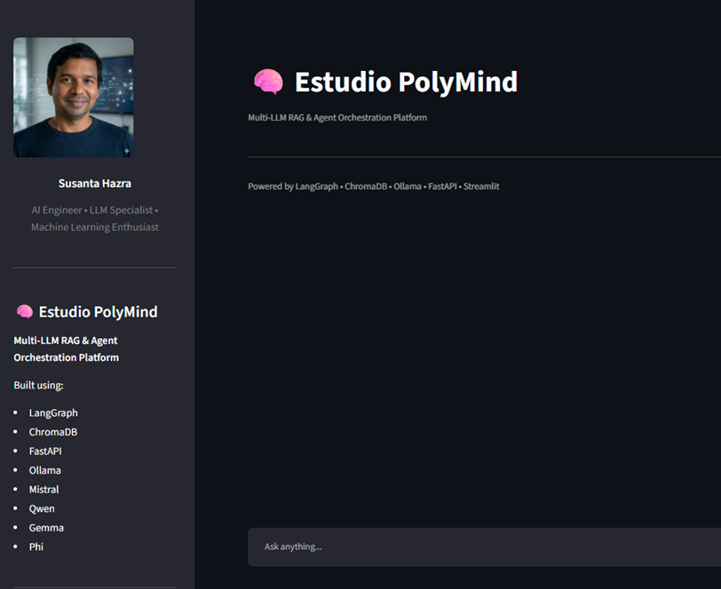
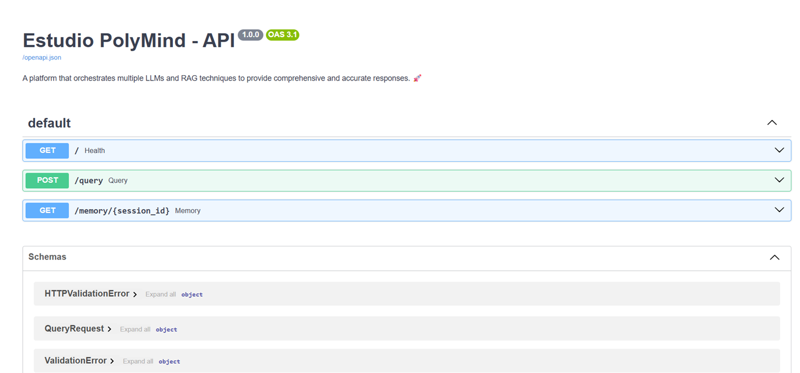
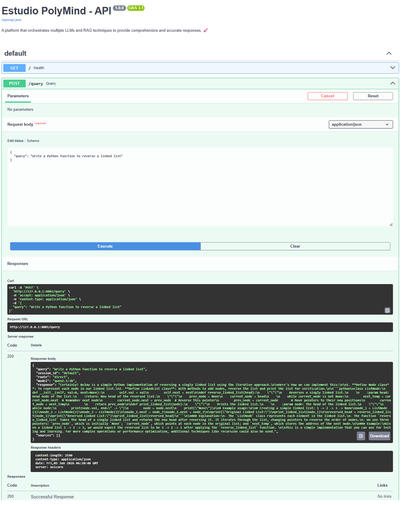
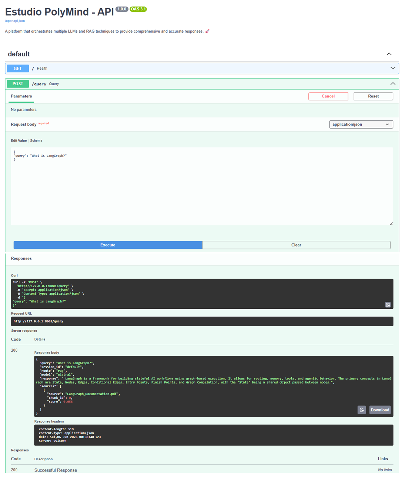

# 🧠 Estudio PolyMind

### Multi-LLM RAG & Agent Orchestration Platform

[]()
[]()
[]()
[]()
[]()
[]()

---

## 🚀 Overview

Estudio PolyMind is a production-style Multi-LLM Retrieval-Augmented Generation (RAG) platform that orchestrates multiple open-source Large Language Models through LangGraph workflows.

The platform supports:

- Multi-LLM routing
- Retrieval-Augmented Generation (RAG)
- Persistent conversation memory
- Tool calling
- Dynamic workflow orchestration
- Local-first deployment using Ollama
- Source-aware document retrieval

Built to demonstrate modern AI Engineering and Agentic AI architecture patterns.

---

## ⚡ Quick Start

### 1. Clone the Repository

```bash
git clone https://github.com/Susanta2025-lab/estudio-polymind-llm-orchestration.git

cd estudio-polymind-llm-orchestration
```

### 2. Install Dependencies

```bash
pip install -r requirements.txt
```

### 3. Start Ollama

```bash
ollama serve
```

Pull any required models:

```bash
ollama pull mistral
ollama pull qwen
ollama pull gemma
ollama pull phi
```

### 4. Ingest Documents

```bash
make ingest
```

### 5. Start FastAPI Backend

```bash
make api
```

### 6. Launch Streamlit UI

```bash
make ui
```

### 7. Open the Application

```text
http://localhost:8501
```

---

## ✨ Key Features

### 🧠 Multi-LLM Orchestration

Dynamically routes requests between:

- Mistral
- Qwen
- Gemma
- Phi

based on query type and workflow requirements.

---

### 🔍 Retrieval-Augmented Generation (RAG)

- PDF ingestion pipeline
- Text document ingestion
- Embedding generation
- ChromaDB vector storage
- Semantic retrieval
- Source tracking
- Relevance scoring

---

### 🔄 LangGraph Workflow Engine

Implements graph-based orchestration:

```text
 User Query
      │
      ▼
 Router Node
      │
      ▼
 Model Router
      │
  ┌────┼────┐
  │    │    │
  ▼    ▼    ▼
 RAG Direct Tool
  │    │    │
  └────┴────┘
      │
      ▼
 Response
```

---

### 🧾 Persistent Memory

Stores conversation history across sessions.

Features:

- Session-based memory
- Persistent storage
- Context continuity
- Long-running interactions

---

### 🛠 Tool Calling

Current tools include:

- Calculator
- Date & Time Utility

Extensible architecture for future tools.

---

### Hybrid Retrieval

PolyMind combines:

- ChromaDB Semantic Search
- BM25 Keyword Search

to improve retrieval quality and reduce missed document matches.

---

## 🏗 System Architecture

### High-Level Overview

The system is built on a **layered architecture** with the following components:

**User Interface Layer:**
- Streamlit UI (Port 8501) - Interactive web-based chat interface
- FastAPI REST API (Port 8000) - RESTful endpoints for external integrations

**Request Processing Layer:**
- Request Router - Session management and request validation
- LangGraph Orchestration Engine - Graph-based workflow execution

**Execution Layer:**
- Router Node - Intent detection and context analysis
- Model Router Node - Conditional routing logic
- Three execution paths: RAG, Direct LLM, or Tools

**Backend Services:**
- LLM Integration - Ollama client and model selection
- RAG Pipeline - Document retrieval and augmentation
- Memory Store - Persistent conversation history
- Tool System - Calculator, DateTime utilities

---

### Request Flow

```
1. User Input (Streamlit UI or FastAPI Endpoint)
   |
   v
2. Request Validation & Session Loading
   |
   v
3. LangGraph Workflow Execution
   |
   v
4. Router Node: Analyze query intent
   |
   v
5. Model Router Node: Decide execution path
   |
   +-> RAG Path: Retrieve documents + LLM inference
   +-> Direct LLM Path: Session context + LLM inference
   +-> Tool Path: Execute calculator or datetime tool
   |
   v
6. Response Generation & Formatting
   |
   v
7. Memory Persistence (store conversation)
   |
   v
8. Return Response (to UI or API client)
```

---

### Execution Paths

**RAG Path (Knowledge-Based Queries):**
- Parse and embed user query
- Search ChromaDB with vector embeddings
- Fallback to BM25 keyword search if needed
- Rank and deduplicate results
- Augment prompt with retrieved context
- Run LLM inference
- Return response with source attribution

**Direct LLM Path (General Conversation):**
- Retrieve user session context
- Build prompt from conversation history
- Run LLM inference directly
- Return formatted response

**Tool Path (Utility Queries):**
- Identify required tool (calculator, datetime)
- Extract parameters from query
- Execute tool with parameters
- Format and return results

---

### Component Interactions

```
Streamlit UI ←→ FastAPI API
     ↓              ↓
     └──→ LangGraph Workflow ←──┘
            ↓         ↓         ↓
         Router  Model Router  State
            ↓
     ┌──────┼──────┐
     ↓      ↓      ↓
   RAG   Direct  Tools
     ↓      ↓      ↓
   Query  Prompt  Execute
     ↓      ↓      ↓
   ChromaDB LLM  Utilities
     │      │      │
     └──────┼──────┘
            ↓
        Memory Store
            ↓
        Response
```

---

### Technology Stack

**Frontend:**
- Streamlit - Interactive web UI

**Backend:**
- FastAPI - REST API framework
- LangGraph - Workflow orchestration
- Pydantic - Data validation

**LLMs:**
- Ollama - Local LLM runtime
- Mistral, Qwen, Gemma, Phi - Language models

**Vector Search:**
- ChromaDB - Vector database
- Sentence Transformers - Embedding models
- BM25 - Keyword search

**Data Processing:**
- PyPDF - PDF parsing
- LangChain - LLM utilities

---

## 📂 Project Structure

```
estudio-polymind-llm-orchestration/
│
├── api/                                 # FastAPI REST API
│   └── app.py                          # Main API server with endpoints
│
├── ui/                                  # Streamlit Web Interface
│   ├── app.py                          # Streamlit application
│   └── assets/
│       └── susanta.png                 # Profile image
│
├── graph/                               # LangGraph Orchestration
│   ├── langgraph_flow.py              # Graph definition and compilation
│   ├── nodes.py                        # Node implementations
│   └── state.py                        # Graph state schema
│
├── llm/                                 # LLM Integration
│   ├── models.py                       # Model configurations
│   ├── ollama_client.py                # Ollama client wrapper
│   └── router.py                       # Model routing logic
│
├── rag/                                 # RAG Pipeline
│   ├── chunking.py                     # Document chunking strategies
│   ├── embeddings.py                   # Embedding generation
│   ├── ingest.py                       # Document ingestion orchestrator
│   ├── retriever.py                    # Retrieval engine
│   ├── test_retriever.py               # Retriever tests
│   ├── vectordb.py                     # ChromaDB wrapper
│   └── loaders/
│       ├── pdf_loader.py               # PDF document loading
│       └── text_loader.py              # Text document loading
│
├── data/                                # Sample Data
│   └── docs/                            # Reference documents
│       ├── ai_notes.text
│       ├── LangGraph_Documentation.pdf
│       ├── original_rag_paper.pdf
│       ├── rag_survey.pdf
│       ├── rag_using_llm.pdf
│       └── information_retrieval_*.pdf
│
├── memory/                              # Conversation Memory
│   ├── memory_store.py                 # Memory management
│   └── chat_history.json               # Persistent storage
│
├── tools/                               # Extensible Tools
│   ├── calculator.py                   # Math calculator tool
│   └── datetime_tool.py                # Date/time utility tool
│
├── utils/                               # Utilities
│   └── logger.py                       # Logging configuration
│
├── experiments/                         # Research & Testing
│   ├── test_bm25.py                    # BM25 search experiments
│   ├── test_hybrid.py                  # Hybrid retrieval tests
│   ├── test_langgraph_chunks.py        # LangGraph chunking tests
│   ├── test_pdf.py                     # PDF ingestion tests
│   └── test_retriever.py               # Retriever evaluation
│
├── media/                               # Visualizations
│   ├── streamlit_ui.png
│   ├── swagger_ui.png
│   ├── model_routing.png
│   └── rag_query.png
│
├── chroma_db/                           # Vector Store (auto-created)
│
├── .gitignore
├── Makefile                             # Development commands
├── requirements.txt                     # Python dependencies
└── README.md                            # Documentation
```

### Directory Descriptions

- **api/** - FastAPI backend with REST endpoints for query processing and memory retrieval
- **ui/** - Streamlit web application with chat interface and document management
- **graph/** - LangGraph workflow definition with nodes and state management
- **llm/** - Ollama integration and LLM model routing logic
- **rag/** - Complete RAG pipeline with document ingestion, embedding, and retrieval
- **data/docs/** - Reference documents for RAG demonstrations
- **memory/** - Persistent conversation history and session management
- **tools/** - Extensible tool system (calculator, datetime utilities)
- **experiments/** - Experimental features and optimization tests
- **media/** - Screenshots and system visualizations

---

## 📸 Demo

### Streamlit User Interface

Interactive web-based interface for querying and managing RAG pipelines.



---
### FastAPI API Interface



---
### Dynamic Model Selection

PolyMind automatically routes requests to the most suitable model.



---
### Source-Aware RAG



---
## 🔄 Workflow Example

### Example Query

```json
{
  "query": "What is LangGraph?",
  "session_id": "default"
}
```

### Workflow Execution

```text
User Query
    │
    ▼
Router Node
    │
    ▼
Model Router
    │
    ▼
RAG Path
    │
    ▼
Retriever
    │
    ▼
ChromaDB
    │
    ▼
Mistral
    │
    ▼
Response + Sources
```

### Example Response

```json
{
  "route": "rag",
  "model": "mistral",
  "response": "LangGraph is a framework for building stateful AI workflows...",
  "sources": [
    {
      "source": "LangGraph_Documentation.pdf",
      "chunk_id": 0
    }
  ]
}
```

---

## ⚙️ Technology Stack

### LLMs

- Mistral
- Qwen
- Gemma
- Phi

### AI Frameworks

- LangGraph
- Ollama
- Sentence Transformers

### Backend

- FastAPI
- Pydantic

### Frontend

- Streamlit

### Retrieval

- ChromaDB
- Vector Embeddings
- Semantic Search

### Infrastructure

- Local LLM Deployment
- Persistent Storage
- Session Memory

### Development

- Makefile
- Git
- GitHub

---

## 📈 Current Capabilities

✅ Multi-LLM Routing

✅ Local LLM Inference

✅ RAG Pipeline

✅ ChromaDB Vector Search

✅ Source-Aware Retrieval

✅ LangGraph Orchestration

✅ Persistent Conversation Memory

✅ Tool Calling

✅ FastAPI Backend

✅ Streamlit UI

✅ Session-Based Context

✅ PDF & Text Document Ingestion

✅ Dynamic Model Selection

✅ Makefile-Based Development Workflow


---

## 🔮 Upcoming Roadmap

### Phase 6

- Hybrid Search (BM25 + Vector Search)
- Reranking Pipeline
- Multi-Agent Collaboration
- Streaming Responses
- Evaluation Framework

### Phase 7

- vLLM Deployment
- GPU Inference
- Distributed Agents
- MCP Integration
- Production Monitoring

---

## 🎯 Learning Outcomes

This project demonstrates:

- Agentic AI Systems
- Multi-LLM Architectures
- Retrieval-Augmented Generation
- Graph-Based Orchestration
- Vector Databases
- Memory Systems
- Local AI Deployment
- Production AI Engineering

---

## 👨‍💻 Author

### Susanta Hazra

AI Engineer | ML Engineer | Generative AI Enthusiast

Specializing in:

- Large Language Models (LLMs)
- Retrieval-Augmented Generation (RAG)
- LangGraph & AI Agents
- FastAPI & MLOps
- Production AI Systems

GitHub:
https://github.com/Susanta2025-lab

LinkedIn:
https://www.linkedin.com/in/susantahazra/

---
