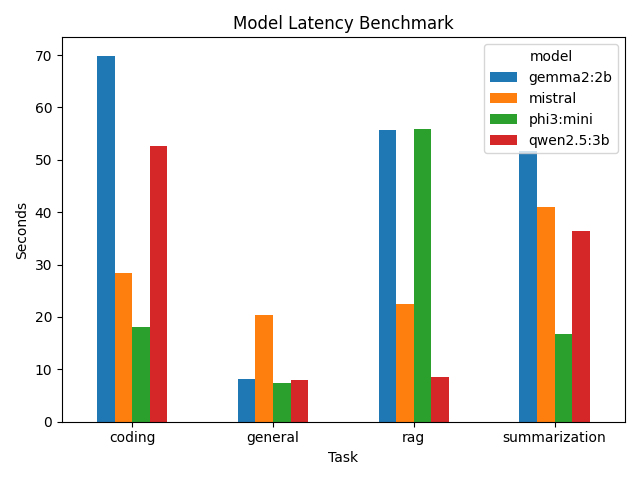
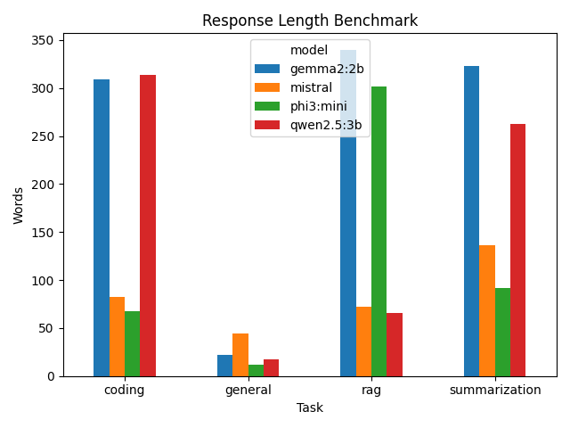

# 🧠 Estudio PolyMind

### Multi-LLM RAG & Agent Orchestration Platform

[]()
[]()
[]()
[]()
[]()
[]()
[]()

A production-style AI Engineering platform that combines **Multi-LLM orchestration**, **Retrieval-Augmented Generation (RAG)**, **semantic routing**, **hybrid retrieval**, **cross-encoder reranking**, **conversation memory**, and **local LLM inference** using Ollama.

Built to demonstrate modern AI Engineering practices including:

- Multi-LLM orchestration
- Retrieval pipelines
- Semantic search
- Agent workflows
- Model routing
- Local-first deployment

---

# 🎯 System Overview

Estudio PolyMind orchestrates multiple local LLMs through LangGraph workflows.

```text
User Query

↓

Semantic Router

↓

Model Router

↓

RAG / Tool / Direct LLM

↓

Conversation Memory

↓

Selected LLM

↓

Final Response
```

Core capabilities:

- Multi-LLM orchestration
- Semantic query routing
- Hybrid retrieval
- Cross-encoder reranking
- Persistent conversation memory
- Local AI inference

---

# 🚀 Key Features

## Multi-LLM Orchestration

Supports multiple local LLMs through Ollama:

- Mistral
- Qwen 2.5
- Gemma 2
- Phi-3 Mini

Dynamic model selection:

| Task | Model |
|------|------|
| General reasoning | Mistral |
| Coding | Qwen 2.5 |
| Summarization | Gemma 2 |
| Fast responses | Phi-3 Mini |

---

## Semantic Query Routing

Uses Sentence Transformers embeddings and cosine similarity for semantic intent classification.

Routes queries into:

- RAG Pipeline
- Tool Execution
- Direct LLM Response

Example:

| Query | Route |
|------|------|
| What is LangGraph? | RAG |
| What time is it? | Tool |
| Tell me a joke | Direct |

---

## Advanced RAG Pipeline

### Document Ingestion

Supports:

- PDF documents
- Text files

### Chunking

Documents are split into semantic chunks before indexing.

### Embeddings

```text
sentence-transformers/all-MiniLM-L6-v2
```

### Vector Database

```text
ChromaDB
```

---

## Hybrid Retrieval

Combines:

### Dense Retrieval

- Semantic embeddings
- ChromaDB similarity search

### Sparse Retrieval

- BM25 keyword retrieval

### Fusion

Uses:

```text
Reciprocal Rank Fusion (RRF)
```

to combine dense and sparse rankings.

---

## Cross-Encoder Reranking

Retrieved documents are reranked using:

```text
cross-encoder/ms-marco-MiniLM-L-6-v2
```

Benefits:

- Better relevance ranking
- Improved context quality
- Reduced retrieval noise

---

## Conversational Memory

Persistent session-based memory:

- User history tracking
- Context-aware conversations
- Session persistence

Storage:

```text
memory/chat_history.json
```

---

## Tool Calling

Integrated utility tools.

### Calculator

```text
Calculate 45 * 78
```

### Current Time

```text
What time is it?
```

---

## FastAPI Backend

REST API for:

- Query processing
- Memory retrieval
- Multi-LLM orchestration
- RAG execution

Swagger documentation:

```text
http://localhost:8001/docs
```

---

## Streamlit Interface

Interactive chat interface featuring:

- Chat history
- Source attribution
- Route visualization
- Model visualization
- Session management

---

# 🏗️ System Architecture

```text
                    User Query
                         │
                         ▼
                Semantic Router
          (RAG / Tool / Direct LLM)
                         │
                         ▼
                  Model Router
                         │
        ┌────────────────┼────────────────┐
        │                │                │
        ▼                ▼                ▼
      RAG             Tool Node      Direct LLM
        │
        ▼
 ┌─────────────────┐
 │ Dense Retrieval │
 │   (ChromaDB)    │
 └────────┬────────┘
          │
          ▼
 ┌─────────────────┐
 │ BM25 Retrieval  │
 └────────┬────────┘
          │
          ▼
 ┌─────────────────┐
 │  RRF Fusion     │
 └────────┬────────┘
          │
          ▼
 ┌─────────────────┐
 │ Cross Encoder   │
 │   Reranker      │
 └────────┬────────┘
          │
          ▼
 ┌─────────────────┐
 │ Conversation    │
 │ Memory Context  │
 └────────┬────────┘
          │
          ▼
 ┌─────────────────┐
 │ Selected LLM    │
 └────────┬────────┘
          │
          ▼
      Final Answer
```

---

# 📊 Multi-LLM Benchmark

The platform benchmarks local LLMs to drive evidence-based routing decisions.

| Model | Role | Strength | Typical Usage |
|------|------|----------|--------------|
| Phi3 Mini | Fast inference | Lowest latency | Quick responses |
| Gemma 2 | Summarization | Detailed summaries | Document summarization |
| Qwen 2.5 | Coding | Strong code generation | Programming tasks |
| Mistral | General reasoning | Balanced performance | Default assistant |

Benchmark metrics:

- Response latency
- Response length
- Task specialization
- Overall efficiency

### Latency Comparison



### Response Length Comparison



These benchmarks justify the dynamic model router implemented in Estudio PolyMind.

---

# 📂 Project Structure

```text
estudio-polymind-llm-orchestration
│
├── api/
├── config/
├── graph/
├── llm/
├── memory/
├── rag/
├── tools/
├── ui/
├── experiments/
├── results/
├── data/docs/
└── chroma_db/
```

---

# 🛠️ Tech Stack

| Category | Technology |
|----------|------------|
| Language | Python |
| Backend | FastAPI |
| Frontend | Streamlit |
| Workflow Engine | LangGraph |
| Vector Database | ChromaDB |
| Embeddings | Sentence Transformers |
| Reranker | Cross Encoder |
| Retrieval | BM25 + RRF |
| LLM Runtime | Ollama |
| Models | Mistral, Qwen2.5, Gemma2, Phi3 |

---

# 🧪 Evaluation Framework

Implemented evaluation workflows for:

```bash
python experiments/test_retriever.py
python experiments/test_bm25.py
python experiments/test_hybrid.py
python experiments/test_router.py
python experiments/test_langgraph_chunks.py
python experiments/test_reranker.py
python experiments/test_retrieval_eval.py
python experiments/test_streaming.py
python experiments/test_pdf.py
```

Metrics:

- Retrieval recall
- Source accuracy
- Router accuracy
- Hybrid retrieval performance
- Reranking quality

---

# ⚙️ Installation

## Clone Repository

```bash
git clone https://github.com/Susanta2025-lab/estudio-polymind-llm-orchestration.git

cd estudio-polymind-llm-orchestration
```

## Create Environment

```bash
python -m venv .venv

source .venv/bin/activate
```

## Install Dependencies

```bash
pip install -r requirements.txt
```

---

# 🚀 Running the Project

## Build Vector Database

```bash
make ingest
```

## Start API

```bash
make api
```

## Start UI

```bash
make ui
```

## Run Full System

```bash
make dev
```

---

# 🔬 Phase Roadmap

## Phase 1 ✅

Multi-LLM Setup

## Phase 2 ✅

ChromaDB Integration

## Phase 3 ✅

RAG Pipeline

## Phase 4 ✅

LangGraph Orchestration

## Phase 5 ✅

Conversation Memory

## Phase 6 ✅

- Semantic Router
- Hybrid Retrieval
- BM25 Search
- RRF Fusion
- Cross-Encoder Reranking
- Retrieval Evaluation
- Streaming Generation
- FastAPI + Streamlit Integration

## Phase 7 🚧

- Configuration Management
- Environment Variables
- Observability
- Multi-Session Support
- Multi-LLM Benchmarking
- Dockerization (next)
- GitHub Actions CI (next)

---

# 📸 Screenshots

### Streamlit Interface


### Swagger API


### Model Routing


### RAG Query


---

# 👨‍💻 Author

**Susanta Hazra**

AI Engineer | ML Engineer | Generative AI Enthusiast

Specializing in:

- Large Language Models (LLMs)
- Retrieval-Augmented Generation (RAG)
- LangGraph & AI Agents
- FastAPI & MLOps
- Production AI Systems

GitHub:

https://github.com/Susanta2025-lab

LinkedIn:

https://www.linkedin.com/in/susantahazra/

---

# ⭐ Project Status

Version: v1.0.0

Status: Complete

Process Included:

✅ Multi-LLM Orchestration

✅ RAG Pipeline

✅ LangGraph Workflows

✅ Semantic Routing

✅ Hybrid Retrieval

✅ BM25 + RRF Fusion

✅ Cross-Encoder Reranking

✅ Session Memory

✅ FastAPI + Streamlit

✅ Multi-LLM Benchmarking

✅ Dockerization

✅ GitHub Actions CI ("passing").


Focus Areas:

- Multi-LLM Orchestration
- Agentic AI
- Retrieval-Augmented Generation
- Semantic Search
- Local AI Infrastructure
- AI Engineering

---

# ⭐ If you found this project interesting, consider giving it a star!
