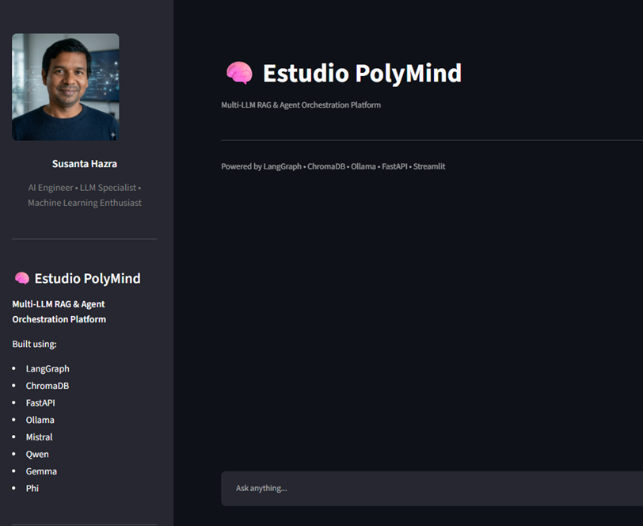
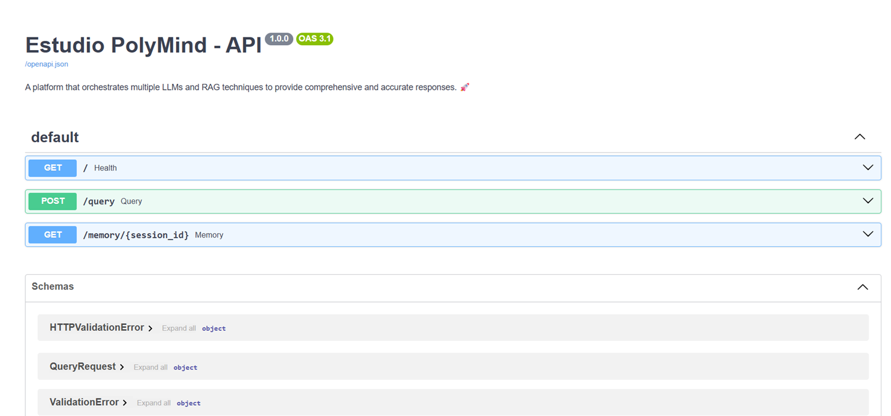
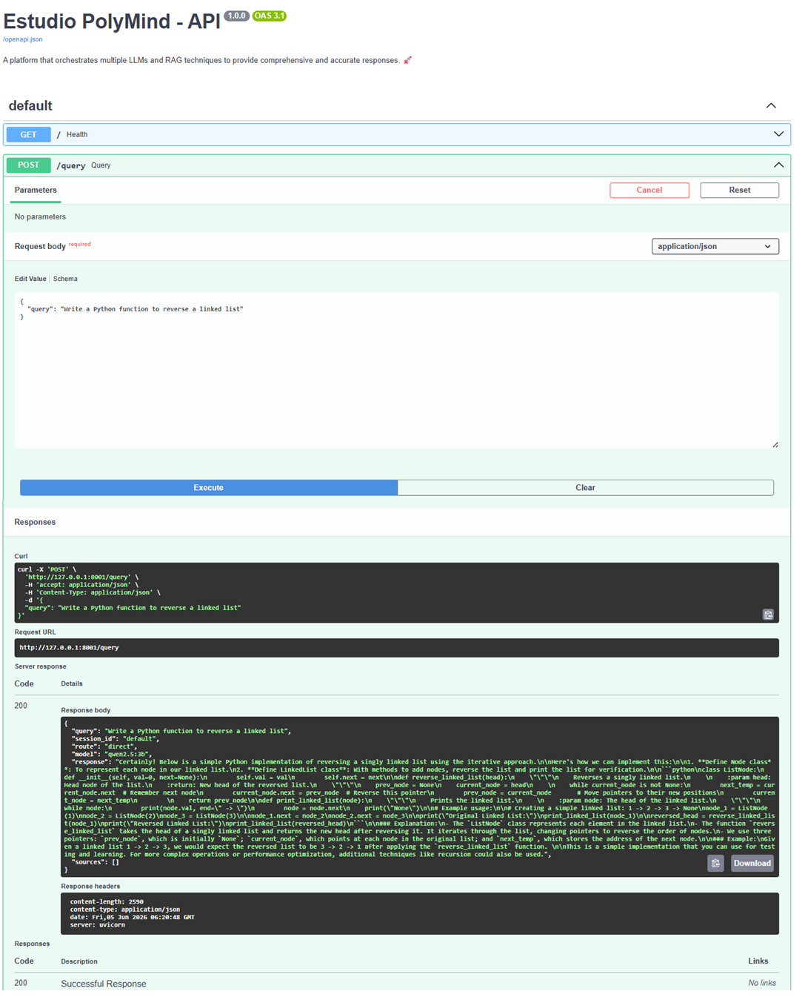
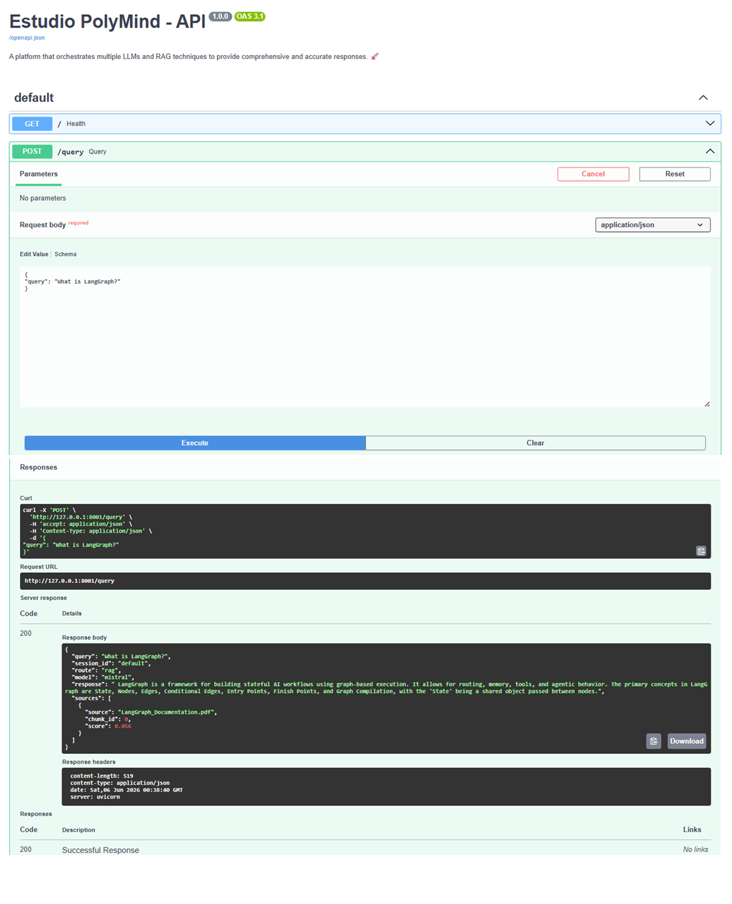

# 🧠 Estudio PolyMind

### Multi-LLM RAG, Agent Orchestration & Document Intelligence Platform

[](https://www.python.org/)
[](https://fastapi.tiangolo.com/)
[](https://streamlit.io/)
[](https://langchain-ai.github.io/langgraph/)
[](https://www.trychroma.com/)
[](https://redis.io/)
[](https://ollama.com/)

[](https://azure.microsoft.com/)
[](https://kubernetes.io/)
[](https://helm.sh/)
[](https://prometheus.io/)
[](https://www.docker.com/)
[](https://docs.vllm.ai/)
[](https://github.com/Susanta2025-lab/estudio-polymind-llm-orchestration/actions/workflows/ci.yml)

Estudio PolyMind is a production-style AI engineering platform for **multi-LLM orchestration**, **hybrid RAG**, **semantic routing**, **streaming inference**, **conversation memory**, and a growing **evidence-grounded document-intelligence pipeline**.

The project is deliberately provider-neutral. Local development can use **Ollama**; external inference uses the existing **OpenAI-compatible adapter**, which can target services such as **Azure Foundry**, **OpenAI-style endpoints**, or a separately operated **vLLM** server.

> **Current status:** Phase 17A–17E of the Production Document Digestion & Intelligence roadmap are complete. Phase 17F — **RAG Publication, Provenance & Interactive Document Analysis** — is next. The Phase 17E application contracts passed the complete local suite with **543 tests**. Live Foundry document-digestion validation remains pending because the Phase 17E execution environment did not contain the required endpoint/model/key configuration.

---

## Why this project exists

PolyMind is built to demonstrate more than a simple chatbot. The repository focuses on production-oriented AI engineering concerns such as:

- provider-neutral inference and logical model routing;
- RAG with dense + sparse retrieval and reranking;
- deterministic streaming and failure handling;
- shared conversation state;
- Kubernetes/Helm deployment boundaries;
- observability and autoscaling contracts;
- durable document-processing jobs;
- immutable provenance and evidence tracking;
- hierarchical long-document synthesis;
- rate-limit, retry and usage accounting;
- explicit separation between retrieval representations and canonical source evidence.

---

# System architecture

PolyMind currently has two complementary application planes.

## 1. Interactive query plane

```text
User Query
    │
    ▼
Semantic Router
    │
    ▼
Model Router
    │
    ├───────────────┬────────────────┐
    ▼               ▼                ▼
   RAG           Tool Node       Direct LLM
    │
    ▼
Dense Retrieval (Chroma)
    +
BM25 Sparse Retrieval
    │
    ▼
Reciprocal Rank Fusion
    │
    ▼
Cross-Encoder Reranker
    │
    ▼
Conversation Memory / Prompt Construction
    │
    ▼
InferenceProvider
    ├── Ollama
    └── OpenAI-compatible
          ├── Azure Foundry
          ├── OpenAI-style service
          └── external vLLM
    │
    ▼
Final Response
```

## 2. Document-intelligence plane

Implemented through Phase 17E:

```text
PDF / Text
   │
   ▼
Canonical extraction + immutable provenance
   │
   ▼
Durable job orchestration
   │
   ▼
Deterministic structural map
   │
   ▼
Bounded analysis chunks
   │
   ▼
Hierarchical evidence-grounded synthesis
   │
   ▼
Coverage / qualification / contradiction validation
   │
   ▼
Managed provider-neutral inference
   │
   ▼
Immutable document digest + evidence lineage
   │
   ▼
Phase 17F: controlled RAG publication (next)
```

The canonical document plane is intentionally separate from Chroma, BM25 and conversation memory. **Chroma is derived retrieval state, not the authoritative document store.**

---

# Core capabilities

## Multi-LLM orchestration

Application routing uses logical roles rather than provider-specific model names:

- `general`
- `coding`
- `summarization`
- `fast`

The default Ollama mapping uses Mistral, Qwen 2.5, Gemma 2 and Phi-3 Mini. Each provider maintains its own logical-role-to-served-model mapping, so LangGraph nodes remain independent of Ollama tags, Azure deployment aliases or vLLM model IDs.

## Semantic routing

Sentence Transformer embeddings and cosine similarity route requests into:

- RAG;
- tool execution;
- direct LLM response.

## Hybrid RAG

The current retrieval path combines:

1. dense retrieval through Chroma;
2. BM25 keyword retrieval;
3. Reciprocal Rank Fusion (RRF);
4. cross-encoder reranking.

Dense embedding model:

```text
sentence-transformers/all-MiniLM-L6-v2
```

Reranker:

```text
cross-encoder/ms-marco-MiniLM-L-6-v2
```

Vector access is provider-neutral. Serving uses read-only vector access; collection creation, upserts, reset and corpus-version publication require an explicit administrative client.

## Conversation memory

Two memory backends are supported:

- `file` — local/single-host development;
- `redis` — shared ordered conversation state for multiple application replicas.

Redis conversation state is independent of Phase 17 document-job state.

## Streaming API

FastAPI exposes:

- `POST /query` — non-streaming response;
- `POST /query/stream` — NDJSON streaming;
- `GET /health` — process liveness;
- `GET /ready` — dependency readiness;
- `GET /metrics` — Prometheus-format metrics.

Streaming emits bounded `metadata`, `chunk`, `done` and sanitized `error` events. Incomplete streams are not persisted as successful conversation exchanges.

## Streamlit UI

The Streamlit interface provides:

- chat history;
- source display;
- route/model visualization;
- session management;
- streaming responses.

---

# Provider-neutral inference

The central boundary remains:

```text
Application / LangGraph / RAG / Document Digestion
                     │
                     ▼
              InferenceProvider
              ┌──────┴────────┐
              ▼               ▼
           Ollama      OpenAI-compatible
```

Provider-specific HTTP/authentication behavior stays inside `llm/`.

| Provider path | Current status |
|---|---|
| Ollama | Supported for local inference |
| OpenAI-compatible | Supported for generation, streaming and bounded structured execution |
| Azure Foundry | Application inference validated in Phase 16; Phase 17E live document-digestion call still pending |
| OpenAI-style endpoint | Protocol compatibility validated locally; no live OpenAI account required |
| External vLLM | Protocol compatibility validated locally; vLLM is not deployed by this repository |

The repository does **not** bundle vLLM, download a large vLLM-served model, or provision GPU infrastructure.

### Main inference settings

| Environment variable | Purpose |
|---|---|
| `INFERENCE_PROVIDER` | `ollama` or `openai_compatible` |
| `OLLAMA_URL` | Ollama chat endpoint |
| `OLLAMA_MODEL_MAP` | Logical-role-to-Ollama-model mapping |
| `OPENAI_COMPATIBLE_BASE_URL` | External OpenAI-compatible base URL |
| `OPENAI_COMPATIBLE_API_KEY` | Optional bearer credential |
| `OPENAI_COMPATIBLE_MODEL_MAP` | Logical-role-to-served-model mapping |
| `OPENAI_COMPATIBLE_GENERATION_PARAMETERS` | Optional generation parameters |
| `OPENAI_COMPATIBLE_READINESS_MODEL_CHECK` | Toggle strict model-membership checking for `/models` |

See `.env.example` and `config/settings.py` for the complete configuration contract.

---

# Production Document Digestion & Intelligence — Phase 17

Phase 17 adds a durable, provenance-aware long-document processing plane without replacing the existing interactive RAG stack.

## Phase 17B — canonical document plane

Implemented:

- immutable document/version identities;
- scoped object references;
- canonical PDF/text extraction;
- page-aware PDF accountability;
- exact text spans and line coordinates;
- evidence references;
- immutable local object storage reference adapter;
- explicit extraction/resource limits.

Current native extraction does **not** perform OCR or image understanding.

## Phase 17C — durable orchestration

Implemented:

- durable jobs and steps;
- idempotent admission;
- SQLite reference ledger;
- leases and monotonically increasing fences;
- retry scheduling;
- cancellation;
- transactional outbox;
- immutable artifact manifests;
- crash/recovery behavior;
- compatible checkpoint reuse.

SQLite is a **reference/local implementation**, not the final shared AKS production database.

## Phase 17D — evidence-grounded hierarchical digestion

Implemented:

- deterministic structural map;
- structure-aware analysis chunks;
- fixed reduction DAG;
- evidence-grounded claims;
- qualification preservation;
- contradiction tracking;
- open questions/limitations;
- COMPLETE / PARTIAL / FAILED digest semantics;
- immutable synthesis checkpoints;
- original-source evidence lineage;
- resume without unnecessary re-analysis.

The full suite after Phase 17D passed **446 tests**.

## Phase 17E — managed inference integration

Implemented:

- `ManagedSynthesisInference` over the existing provider layer;
- deterministic control/data-separated prompts;
- structured-output modes;
- explicit model capability profiles;
- input/output bound enforcement;
- estimated/reserved vs actual token accounting;
- durable per-job inference observations;
- shared reference RPM/TPM/concurrency admission;
- interactive headroom;
- normalized 429 / Retry-After / timeout handling;
- checkpoint compatibility tied to model/profile/capability configuration;
- OpenAI-compatible and external-vLLM protocol tests.

The complete local suite passed:

```text
543 passed
```

### Important Phase 17E limitation

The real Phase 17 document-digestion flow has **not yet been exercised against Azure Foundry**. During Phase 17E closure the local process had no configured Foundry endpoint/model map/key, so zero live calls were made rather than fabricating credentials or changing cloud resources.

Protocol/application integration is complete; real-model quality remains a later validation gate.

---

# RAG publication model

The existing RAG publication mechanism currently:

1. performs deterministic Chroma upserts;
2. publishes `BM25_CORPUS_VERSION` only after all ingestion upserts succeed;
3. builds one immutable process-local BM25 snapshot for that expected/published version;
4. makes replicas unready on version mismatch;
5. relies on controlled replica rollout to load a new sparse snapshot.

This provides version gating but **does not claim atomic multi-document publication, automatic BM25 refresh or blue/green vector publication**.

Phase 17F is specifically intended to add coherent publication generations, canonical provenance, reprocessing/revocation/rollback semantics and interactive document analysis without allowing generated summaries to masquerade as original evidence.

---

# Azure / Kubernetes validation

PolyMind includes a production control-plane Helm chart under:

```text
deployment/helm/polymind/
```

The chart deploys PolyMind application pods and intentionally does **not** own the lifecycle of external inference, Redis, Chroma, Prometheus or cloud infrastructure.

Phase 16 validated the application in a real AKS environment with:

- two healthy PolyMind replicas;
- Azure Foundry inference;
- shared Redis conversation state;
- shared Chroma + BM25 retrieval;
- Prometheus / Adapter / custom-metrics path;
- fixed two-replica runtime.

HPA was left disabled because the observed Foundry limit of **10 requests / 60 seconds** constrained useful higher-load autoscaling calibration. That observation is historical Phase 16 evidence, not a claim about current quota.

Production HA, durable Chroma storage, complete network isolation and broad production-readiness certification are **not** claimed.

For local Kubernetes validation, guarded Kind workflows remain under `deployment/kind/`.

---

# Observability

The application exposes process-local Prometheus metrics for areas including:

- inference requests, latency and normalized failures;
- streaming lifetime and TTFT;
- provider-reported token usage;
- memory operations;
- vector operations/readiness;
- component readiness;
- BM25 snapshot behavior;
- active application requests and streams.

Phase 14/15 added deployment-neutral monitoring, recording/alert rules, Prometheus Adapter contracts and optional HPA support. The chart does not install a monitoring stack.

See:

- [Observability runbook](docs/operations/observability.md)
- [Production security](docs/security/production-security.md)
- [Threat model](docs/security/threat-model.md)

---

# Security boundaries

Current application protections include bounded request IDs, sanitized provider failures, production bearer-token support, secret-safe logging, read-only serving vector access and Helm security controls.

However, the Phase 17 document plane does **not yet claim production multi-user authorization**. Tenant/owner scope is currently trusted application metadata rather than proof of identity.

**Phase 17G** is reserved for real document ownership, authorization, tenant isolation, retention/deletion policy, per-owner quotas and cost governance.

---

# Repository structure

```text
estudio-polymind-llm-orchestration/
├── api/                    # FastAPI application
├── config/                 # Settings and model configuration
├── documents/              # Phase 17 canonical docs, jobs and digestion
│   ├── digestion/
│   └── jobs/
├── graph/                  # LangGraph routing/orchestration
├── llm/                    # Provider-neutral inference + adapters/admission
├── memory/                 # File / Redis conversation memory
├── rag/                    # Dense, BM25, fusion, reranking, vector adapters
├── tools/                  # Utility tools
├── ui/                     # Streamlit interface
├── deployment/             # Helm, Kind and monitoring assets
├── docs/                   # Architecture, operations, security, phase reports
├── tests/
│   ├── unit/
│   └── integration/
├── experiments/            # Evaluation/experimental scripts
├── results/                # Benchmark outputs
└── data/docs/              # Legacy/local RAG documents
```

---

# Tech stack

| Area | Technology |
|---|---|
| Language | Python |
| Backend | FastAPI |
| Frontend | Streamlit |
| Workflow / orchestration | LangGraph + explicit durable Phase 17 workflows |
| Vector retrieval | ChromaDB |
| Sparse retrieval | BM25 |
| Fusion | Reciprocal Rank Fusion |
| Reranking | Cross Encoder |
| Embeddings | Sentence Transformers |
| Conversation state | File / Redis |
| Durable document state | SQLite reference ledger + immutable object-store abstraction |
| Local inference | Ollama |
| External inference | OpenAI-compatible adapter |
| Deployment | Docker, Kubernetes, Helm |
| Cloud validation | Azure AKS + Azure Foundry |
| Observability | Prometheus metrics / rules / adapter contracts |
| CI | GitHub Actions |

---

# Quick start

## Clone

```bash
git clone https://github.com/Susanta2025-lab/estudio-polymind-llm-orchestration.git
cd estudio-polymind-llm-orchestration
```

## Create an environment

```bash
python -m venv .venv
source .venv/bin/activate
```

## Install dependencies

The Makefile installs the pinned CPU ML dependencies first:

```bash
make install
```

Equivalent:

```bash
pip install --no-deps -r requirements-ml-cpu.txt
pip install -r requirements.txt
```

## Run the API

```bash
make api
```

FastAPI documentation is available locally at:

```text
http://localhost:8001/docs
```

## Run the UI

```bash
make ui
```

## Run API + UI

```bash
make dev
```

---

# Local RAG ingestion

Put local PDF/text documents under:

```text
data/docs/
```

Then:

```bash
make ingest
```

For local persistence, the default Chroma configuration can be used. Shared deployment uses `chroma_http` and a controlled corpus version.

Administrative reset is explicit:

```bash
python -m rag.admin reset
```

Serving/API startup never performs ingestion or reset.

---

# Testing and validation

Run the automated suite:

```bash
make test
# or
python -m pytest
```

Validate the Helm chart:

```bash
make helm-validate
```

Validate Compose:

```bash
docker compose config --quiet
```

GitHub Actions currently performs:

1. Python compile validation;
2. complete pytest suite;
3. Helm lint/template validation;
4. Docker Compose configuration validation;
5. Docker image build.

Phase 17E closure recorded **543 passing tests** locally.

---

# Phase roadmap

| Phase | Scope | Status |
|---|---|---|
| 1–7 | Multi-LLM, RAG, LangGraph, memory, routing, hybrid retrieval, API/UI, Docker, CI | ✅ Complete |
| 8A | Provider-neutral inference contract | ✅ Complete |
| 8B | OpenAI-compatible / external vLLM adapter | ✅ Complete |
| 8C–8G | Provider reliability, shared-state/vector boundaries and production topology hardening | ✅ Complete |
| 9–15 | Kubernetes/Helm, security hardening, deterministic model packaging, observability and autoscaling contracts | ✅ Complete |
| 16 | Target-environment capacity/dependency validation on Azure/AKS | ✅ Closed |
| 17A | Architecture, Cost & Risk Assessment | ✅ Complete |
| 17B | Canonical Document Model, Object Storage & Extraction Plane | ✅ Complete |
| 17C | Durable Job Orchestration, Idempotency & Recovery | ✅ Complete |
| 17D | Hierarchical Evidence-Grounded Digestion | ✅ Complete |
| 17E | Managed Inference Integration | ✅ Complete — live Foundry digestion pending |
| 17F | RAG Publication, Provenance & Interactive Document Analysis | ⏭ Next |
| 17G | Multi-User Security, Quotas & Cost Governance | Planned |
| 17H | 200–1000+ Page Reliability, Failure & Quality Validation | Planned |
| 17I | External User Verification | Planned |

After Phase 17, the planned direction is broader Azure productionization of the document pipeline, including durable cloud storage/state, distributed worker/admission infrastructure, identity hardening and production reliability controls.

---

# Phase reports

Detailed engineering evidence is retained in `docs/codex/reports/`.

Current key reports:

- [Phase 16 — Target Environment Validation](docs/codex/reports/phase_16_report.md)
- [Phase 17A — Architecture, Cost & Risk Assessment](docs/codex/reports/phase_17a_report.md)
- [Phase 17B — Canonical Document Model / Extraction Plane](docs/codex/reports/phase_17b_report.md)
- [Phase 17C — Durable Job Orchestration](docs/codex/reports/phase_17c_report.md)
- [Phase 17D — Hierarchical Evidence-Grounded Digestion](docs/codex/reports/phase_17d_report.md)
- [Phase 17E — Managed Inference Integration](docs/codex/reports/phase_17e_report.md)

The reports distinguish verified behavior from deferred production claims.

---

# Current limitations

The repository should **not** currently be interpreted as claiming:

- production multi-user document authorization;
- Azure Blob-backed canonical document storage;
- a production distributed document-job database/queue;
- production distributed inference admission;
- live Phase 17 Foundry document-digestion validation;
- live OpenAI validation;
- live external vLLM validation;
- self-hosted vLLM/GPU infrastructure;
- OCR/image understanding;
- 1000-page real-model production certification;
- Phase 17 RAG publication;
- full production HA/DR.

These are explicit roadmap items rather than hidden assumptions.

---

# Screenshots

### Streamlit Interface



### Swagger API



### Model Routing



### RAG Query



---

# Author

**Susanta Hazra**

AI Engineer | ML Engineer | Generative AI

Focus areas:

- Large Language Models
- Retrieval-Augmented Generation
- Document Intelligence
- LangGraph / Agentic AI
- FastAPI / MLOps
- Production AI Engineering

- GitHub: https://github.com/Susanta2025-lab
- LinkedIn: https://www.linkedin.com/in/susantahazra/

---

# Project status

**Status:** Active development — production-style portfolio platform  
**Current milestone:** Phase 17F next

The strongest current capabilities are provider-neutral multi-LLM inference, hybrid RAG, shared memory, Kubernetes/Helm operations, Azure target validation, durable document processing, evidence-grounded long-document synthesis, and managed inference integration.

If you find the project useful, consider starring the repository.
