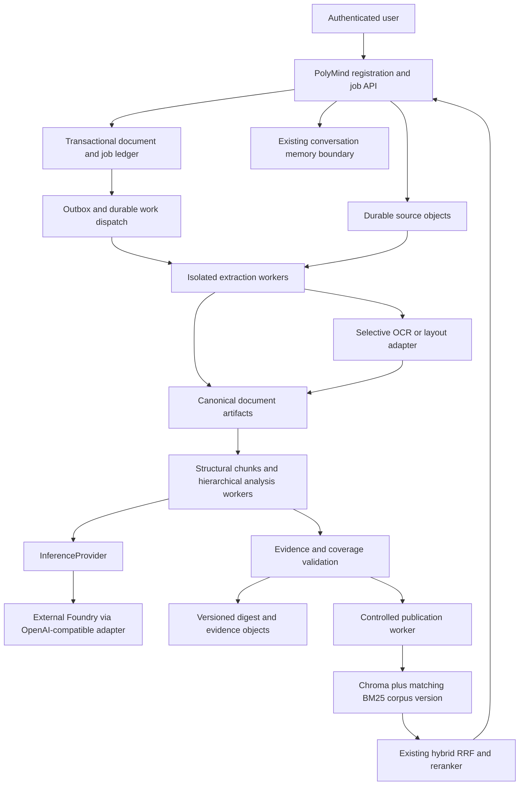

# Phase 17A — Architecture, Cost & Risk Assessment

Date: 2026-10-07. Repository: `Susanta2025-lab/estudio-polymind-llm-orchestration`.
Major phase: **Phase 17 — Production Document Digestion & Intelligence**.

## 1. Executive summary

Extend PolyMind with a durable document-processing plane: immutable source and
artifact objects, a transactional job ledger, recoverable background steps,
selective extraction/OCR, hierarchical evidence-grounded synthesis, and controlled
publication into the existing RAG stack. FastAPI owns admission and user-facing
operations; separately deployed workers own long-running work. Keep inference
behind `InferenceProvider`, with the validated Azure Foundry connection as the
current target. Keep Redis for conversation state and Chroma for derived retrieval.

This is an architecture recommendation, not a deployed capability. Native
extraction should be the default; OCR and layout services are conditional
escalations. A proposed Azure Blob adapter, relational metadata store and managed
queue need later selection gates and operator-approved provisioning. No new cloud
service is required to start Phase 17B contract and local-fixture development.

The largest architectural gaps are durable workflow state, page/block provenance,
publication consistency, tenant authorization and provider-wide cost admission.
Phase 16 proved the application/dependency path, not production durability or
large-document quality. Its 10 RPM/10,000 TPM validation deployment cannot support
unbounded document fan-out; additional application replicas would not fix that.

## 2. Phase result

**Phase 17A — PASS.** Architecture, responsibilities, cost/risk model and gated
implementation roadmap are sufficiently defined to begin Phase 17B. All later
capabilities below are requirements or proposals unless explicitly identified as
existing. No document-digestion pipeline has been implemented. Phase 17B has not
started. No Azure/Kubernetes operations, HPA activation, capacity increase,
provisioning, external user testing, commit or push occurred.

## 3. Existing PolyMind baseline and evidence

Assessment started on `master` at
`f9b47fda4658935b64826f1d4abe0488c64f21ae`. The sole initial modification was
`docs/codex/reports/phase_16_report.md` (1,627 added / 1 removed lines relative to
HEAD). Its intentional closure content was preserved; only roadmap terminology
and the associated handoff wording were changed in this phase.

| Evidence inspected | Implemented baseline and limitation |
| --- | --- |
| [README](../../../README.md), [Phase 8C](phase_8c_report.md), [8D](phase_8d_report.md), [8E](phase_8e_report.md) | Logical model roles, provider-neutral generation, NDJSON streaming, normalized failures, bounded metrics and conversation-memory abstraction. Separate Phase 8A/8B reports are absent; README and provider code document those foundations. |
| [Phase 8F](phase_8f_report.md), [8G](phase_8g_report.md), `rag/vector_store.py`, `rag/chroma_store.py` | Query-only serving versus explicit admin upsert/reset/publication, Chroma local/HTTP selection; no per-document delete or tenant-filter contract. |
| `rag/loaders/pdf_loader.py`, `rag/chunking.py`, `rag/ingest.py` | pypdf concatenates page text into one string; recursive character chunks use size 500/overlap 30. CLI ingests PDF/text from a local directory, embeds one chunk at a time and creates UUIDv5 IDs from filename/index/text. No durable jobs, canonical pages, OCR or upload API. |
| `rag/retriever.py`, `rag/bm25.py`, `rag/hybrid_retriever.py`, `rag/reranker.py`, `graph/generation.py` | Dense + process-local BM25 + RRF + CPU cross-encoder. Deduplication uses `(source, chunk_id)`; normalized retrieval drops richer metadata. BM25 loads the full collection at startup and gates readiness on the expected/published version. |
| `rag/embeddings.py`, [Phase 12](phase_12_report.md) | Pinned CPU MiniLM embedding/reranker models, offline production artifacts. Large synthesis chunks must not silently exceed embedding encoder limits. |
| `llm/inference.py`, `llm/openai_compatible.py`, `graph/nodes.py` | `generate(prompt, role)` returns text; streaming returns tokens. Exact usage feeds metrics, not a per-job return envelope. No application generation retries; safe provider errors preserve existing API behavior. |
| [Phase 9](phase_9_report.md), [10](phase_10_report.md), [11](phase_11_report.md), [security model](../../security/threat-model.md) | External dependency deployment, Kind validation, shared bearer authentication. A shared token is not a user/tenant identity system. |
| [Phase 13](phase_13_report.md), [14](phase_14_report.md), [15](phase_15_report.md), [observability](../../operations/observability.md), [Helm](../../../deployment/helm/polymind/README.md) | Streaming drain budget, bounded capacity evidence, Prometheus rules and opt-in HPA architecture; chart defaults keep HPA disabled. No durable document worker deployment. |
| [Phase 16 authoritative closure, section O](phase_16_report.md#o12-document-digestion-roadmap-handoff-and-final-verdict) | Two fixed real AKS replicas, Foundry, shared Azure Managed Redis, Chroma/BM25 and real application custom-metrics path validated. C1: 6/6 successes. C2: 11/12, with Foundry 429 normalized to overloaded/503. Recorded limits: 10 requests/60 s, 10,000 tokens/60 s, capacity 10. This is historical operator evidence, not a fresh live inspection. |

Phase 16 retained Chroma on volatile `emptyDir`, Redis without HA/persistence,
AKS networkPolicy provider NONE, Adapter `insecureSkipTLSVerify=true`, and
access-key-style Foundry credentials. Workload identity, enforced network
isolation, HA/backups and higher-load calibration remain unproven. Do not infer
production security from chart defaults when the actual validation environment
differs. Earlier Phase 16 pending statuses are superseded by section O.

Existing regression tests inspected include retrieval normalization/RRF/reranking
in `tests/unit/test_retrieval_regression.py`, vector contracts in
`test_vector_store.py`, and version gating, serving/admin separation and
publish-after-upserts in `test_deployment_topology.py`. They do not prove atomic
publication, authorization or document digestion. Relevant settings, graph
consumers, memory modules, API/UI source consumers and deployment documentation
were inspected; no interface was modified.

## 4. Problem definition and exclusions

A digest of a 200–1,000+ page report must cover the whole document, preserve
qualifications and contradictions, and let a user inspect the evidence behind
important conclusions. Query-time retrieval selects only a small relevant subset;
it cannot establish complete coverage. A giant single prompt is constrained by
context limits, cost, latency and uneven attention even when it fits.

Page count alone is not a work limit: an image-heavy manual, dense legal schedule
and scanned collection have very different bytes, tokens and extraction cost.
Admission must constrain bytes, pages, expanded pixels, tokens and work units.
Packages eventually need member identities and a manifest; initial Phase 17B
scope should support PDF and plain text only, with no recursive archive ingestion.

Out of scope: replacing RAG, moving vLLM/GPU runtime into PolyMind, another active
cloud, autonomous document tools, model training, universal format support,
production HA remediation, legal compliance certification, cloud procurement,
and any implementation/provisioning in Phase 17A.

## 5. Functional requirements

1. Register a document version, validate a bounded upload, compute a server-verified
   checksum, and record ownership and a reproducible processing profile.
2. Extract native text with source locations; escalate selected pages for layout
   or OCR; explicitly represent unsupported, failed and unextractable content.
3. Produce normalized structural artifacts and stable evidence references before
   any synthesis. Preserve tables and figure references without inventing text.
4. Run resumable jobs with status, honest progress, cancellation, retry policy,
   duplicate detection, retained artifacts and sanitized failure information.
5. Generate hierarchical digests with coverage and evidence checks. Return
   qualified partial results separately from complete, publishable results.
6. Publish approved document versions through the existing dense/BM25/hybrid
   retrieval and support cited interactive analysis, revocation and reprocessing.
7. Enforce ownership, quotas and retention throughout, with external multi-user
   access disabled until Phase 17G and Phase 17H gates pass.

## 6. Non-functional requirements

Durability must cover acknowledged uploads and committed step outputs across
worker restarts. Assume at-least-once work delivery, tolerate duplicate execution,
and guarantee one accepted result per step key through conditional commit. Do not
promise exactly-once provider billing. Bound CPU, memory, temporary disk, provider
concurrency, retry count and total document budget.

Version every transformation and artifact schema; make replay auditable and
independent of conversational history. Keep existing query/stream APIs compatible.
Use normalized errors, restricted service credentials and content-free operational
telemetry. Authorization must fail closed at every data boundary. Measured
throughput, quality and recovery targets belong to Phase 17H; no production
latency or HA SLO is established here.

## 7. Target conceptual architecture



The ledger controls state transitions and references committed object manifests.
The queue carries opaque work references, never source documents or credentials.
Workers checkpoint bounded page/chunk/section tasks; the whole document is not
one lock held for hours. A reconciliation process repairs lost dispatch and
orphaned objects. LangGraph may compose analysis steps, but an in-process graph
or FastAPI background task is not the durability authority.

## 8. Component ownership and deployment boundaries

| Owner | Responsibility |
| --- | --- |
| PolyMind API/control plane | Authentication context, validation, quota admission, registration, status/results, cancellation intent, interactive analysis and compatible API extensions. |
| PolyMind domain modules | Canonical/evidence contracts, stage policy, idempotency keys, quality gates, publication manifests and neutral adapters; reusable in workers and tests. |
| Separately deployed PolyMind workers | Extraction sandbox, CPU embeddings, bounded analysis/synthesis, artifact validation and publication; independent resource limits and lifecycle from query replicas. Separate deployment does not imply a new product/framework. |
| Platform-operated dependencies | Durable objects, metadata database, work queue, external OCR if selected, inference, shared Chroma/Redis and monitoring. Operators own backups, credentials, encryption, retention and capacity. |
| Existing application retrieval | Dense/BM25/RRF/reranker composition, extended to retain evidence and enforce authorized corpus selection. No second search engine. |

Keep parser-heavy or OCR dependencies out of the query-serving image unless a
later measured packaging decision requires them. Existing Redis and Chroma
services remain external. Do not add workers or dependencies to Helm in 17A.

## 9. Synchronous versus asynchronous responsibilities

| Request-bound responsibility | Durable background responsibility |
| --- | --- |
| Validate caller, declared file size/type, policy and idempotency request | Inspect actual file, compute/verify checksum, safety checks and page inventory |
| Register upload intent and return bounded upload instructions | Finalize verified objects, clean incomplete uploads, reconcile missing dispatch |
| Accept verified document/job and return proposed 202 plus opaque identifier | Extract, OCR/layout, normalize and segment |
| Read job status, coverage and paginated artifact metadata | Embed retrieval chunks; analyze chunks and synthesize hierarchy |
| Authorize result retrieval or short-lived single-object download | Validate evidence, commit manifests, publish retrieval version and retry |
| Record cancellation intent and return acknowledgement | Stop admission of new work, fence stale workers and settle active steps |
| Existing interactive RAG on an authorized published version | Reprocessing, revocation cleanup and retention sweeps |

These are conceptual extensions, not implemented endpoints. For large files,
prefer scoped direct-to-object upload with bounded expiry/size where enforceable;
alternatively stream through a dedicated bounded upload handler. Transfer itself
may take time but must not allocate the full file in API RAM or start synchronous
processing. Finalization verifies actual size/checksum before QUEUED. Do not raise
the existing query-body limit globally to accommodate uploads. Return normalized
validation failures; a 202 acknowledges durable admission, not completed work.

## 10. Storage architecture

| Storage class | Contents and authority | Proposed placement |
| --- | --- | --- |
| A. Raw objects | Immutable original per owner/document version, verified SHA-256, original name as display metadata, MIME, bytes and retention class | Durable object storage; Azure Blob adapter proposed. Generated opaque keys, no filename-derived filesystem paths. |
| B. Processing objects | Page/block text, OCR/layout output, figures, canonical manifests, chunk/evidence maps, intermediate analyses and final digests | Same object-storage boundary with separate access/lifecycle policies and immutable versioned keys; page/section partitions allow bounded reads. |
| C. Metadata/state | Ownership, document/version registry, job/step states, attempts, lease/fence, cancellation, timestamps, sanitized errors, artifact references, outbox, publication and deletion manifests | Transactional database proposed; relational schema is the preferred starting design, technology remains open. Objects contain bulk text; rows contain bounded references. |
| D. Retrieval | Derived vectors, evidence IDs and flat searchable chunk metadata; corpus/embedding versions; BM25-compatible normalized text | Existing Chroma HTTP plus per-process BM25. Object/ledger publication manifest is authoritative for rebuild; Chroma is not the source archive. |
| E. Conversation | Existing ordered exchanges/session TTL | Existing memory abstraction with Redis. Not a job ledger, artifact store or source of digest evidence. |

A completed upload is durable only after storage confirms the object and the
ledger commits its reference. Database/object writes are not a distributed
transaction: create immutable objects first, then conditionally commit their
manifest; an orphan sweep removes unreferenced objects after a grace interval.
Job/outbox insertion should be atomic in the metadata store; the relay can repeat
sends. Never depend on queue retention for authoritative job history.

Proposed metadata alternatives: relational storage supports uniqueness,
transactions and audit queries directly but adds operational cost; a document
store with conditional writes can work if partition/transaction scope covers the
job and outbox; object manifests alone make concurrent scheduling/cancellation
harder; SQLite is useful for local contract tests, not a shared AKS job authority.
Phase 17C must select against transaction semantics, restore tests, regional
availability, operational burden and priced capacity. No database is provisioned.

## 11. Canonical document model requirements for Phase 17B

| Entity | Required contract |
| --- | --- |
| Document/version | Opaque document ID, owner/tenant scope, immutable source-version ID, display filename, detected/declared MIME, verified hash/algorithm, byte size, page count, language/confidence, upload/creation times and retention policy. Hash is not authorization. |
| Page | Physical ordinal with explicit index convention, printed page label separately, source version, dimensions/rotation, extraction status/method/version, OCR engine/model version and confidence where available. Preserve physical ordinal across selected-page OCR batches. |
| Block | Stable block ID/type, source page(s), reading order, text spans with defined offset units, optional polygons/coordinates and units/origin, heading/paragraph/table/figure relationships; retain original text alongside normalized form. |
| Structure | Section/subsection IDs, parent/child hierarchy, heading path, ordered block references and cross-reference targets; inferred hierarchy marked as inferred with confidence, not treated as source fact. |
| Tables/figures | Cell/row/column spans, header links, repeated table headers, continuation relationships, caption/source image reference, available coordinates; unsupported visual interpretation explicit. |
| Chunks/evidence | Stable chunk ID scoped by owner/document/version/segmentation profile and source spans; parent section, bounded text, evidence-unit IDs, overlap links and page/block ranges. Evidence addresses an immutable extraction artifact. |
| Artifact/execution | Schema and artifact version, parser/configuration/normalization versions, parent artifact hashes, object reference/checksum, timestamps, job/step/attempt, model/role and prompt-profile version where generated. |

Page locations, source-version hash, evidence spans and extraction version are
citation-critical. Filename and a chunk number alone are insufficient. Represent
missing text/coordinates/language confidence as unknown, not empty success.
Plain-text files use line/character spans with pages absent; do not invent pages.
Define Unicode offset normalization explicitly and keep raw-to-normalized span
maps where transformations move text. Use schema migration/version compatibility
rules and deterministic serialization tests in Phase 17B.

## 12. Extraction, OCR and layout strategy

| Tier | Escalation decision | Output and failure behavior |
| --- | --- | --- |
| 1: native PDF/text | Start here for every supported document; sample and score every page for usable text, replacement characters, image coverage and reading order | Native text plus page/block locations where supported. A low-text page may be an intentional blank: distinguish from an image scan. |
| 2: layout-aware | Native text exists but columns, tables, rotated blocks, headings or order fail structural checks, or the requested output requires faithful layout | Layout blocks/table structure with lineage back to the source. Benchmark local layout options first; a managed layout model may internally use OCR, so include its full processed-page cost. |
| 3: selective OCR | Image-only pages, visibly text-bearing pages with empty/unusable native extraction, or failed native extraction after a bounded safe retry | OCR only selected physical pages, preserving page remapping, confidence and chosen result. Avoid duplicate native+OCR text; keep alternative artifacts for review if necessary. |

Escalation thresholds require a labeled native/scanned/mixed benchmark in 17B;
do not hard-code an unsupported universal characters-per-page threshold. Process
page batches within provider/file limits and reassemble against the source-page
manifest. Multi-column reading order and multi-page tables need explicit tests.
Headers/footers may be marked repetitive for synthesis while retained in evidence.
Store printed labels independently of physical pages. Figures need captions and
image references; vision interpretation, if later allowed, is generated analysis.

Reject password-protected documents initially with a sanitized actionable error;
do not collect or log passwords. Quarantine malformed files, reject unsupported
formats, cap parser time/memory/pixels and avoid endless fallback cycles. Very large
files need file-backed access and bounded batches; some PDF parsers still index
the whole file, so benchmark peak memory and enforce a subprocess limit.

Azure Document Intelligence Read/Layout is a **candidate**, not installed or
selected. Its documented page selection and layout representation support the
proposed adapter; exact API version, format/size limits, languages, region,
privacy and cost must be checked before integration. See Microsoft's
[Read documentation](https://learn.microsoft.com/en-us/azure/ai-services/document-intelligence/concept-read)
and [Layout documentation](https://learn.microsoft.com/en-us/azure/ai-services/document-intelligence/prebuilt/layout?view=doc-intel-4.0.0)
(accessed 2026-10-07). No external document was submitted.

## 13. Durable job orchestration model for Phase 17C

Proposed normal path:

```text
REGISTERED → UPLOADED → QUEUED → EXTRACTING → NORMALIZING
           → ANALYZING → SYNTHESIZING → VALIDATING → PUBLISHING → COMPLETED
```

UPLOADED means verified durable source, not a client claim. Stage rows carry
runnable/in-progress/retry-wait/succeeded/failed status independently of the job's
summary state. FAILED and CANCELLED are terminal for a run. PARTIAL means explicitly
retained incomplete output with a coverage manifest, never silent COMPLETED.
A retry/resume creates a new run or fenced generation referencing successful
compatible artifacts; it does not erase the failed audit record. OCR is an
extraction substep. Digest completion and search publication are separate status
fields, so a failed publisher need not regenerate the digest.

Use unique `(owner, request_idempotency_key)` admission with a request-content
fingerprint: same key/same request returns the same job; same key/different request
is rejected. Duplicate content can reuse source/extraction within the same scope
only when parser/config versions and access/retention policies match. Do not expose
cross-tenant duplicate existence. A step key includes source hash, stage, unit ID,
artifact/schema/parser/prompt/model/config versions and relevant parent hashes.

Workers claim leases with a monotonically increasing fence. An expired worker
cannot commit after a newer claimant; cancellation increments or invalidates the
commit generation. Write/checksum the result, conditionally commit its manifest
and successor outbox entries, then acknowledge dispatch. Crash between commit and
ack causes harmless redelivery; crash before commit leaves reusable staged objects
or sweepable orphans. A periodic reconciler recovers expired leases and committed
outbox records that were never delivered. Test lost acknowledgements and duplicate
messages explicitly; queue duplicate detection is only an optimization.

Retry transient storage/network/timeouts and provider overload with bounded
exponential backoff/jitter and a total deadline/budget. Honor sanitized retry delay
if available. Invalid files/schema, authorization and incompatible configuration
need correction, not automatic retries. Cap attempts and quarantine poison work
with a sanitized dead-letter reason and authorized replay action. Never replay
billable analysis merely because publication failed. A timed-out provider call may
already be billed; record that ambiguity and reserve retry budget.

Cancellation is cooperative and durable: reject new steps immediately after the
cancel flag is observed; active calls may finish or time out, but fenced commits
must not publish cancelled output. Report CANCEL_REQUESTED until settling; do not
promise immediate provider cancellation or refund. Progress exposes completed /
total pages, chunks and sections, failed units and current stage. Discovered totals
may increase; avoid fabricated linear percentages or completion ETAs.

Queue comparison and selection gate:

| Option | Fit and tradeoff | Status |
| --- | --- | --- |
| Azure Service Bus | Managed lock/settlement and dead-letter capabilities reduce application dispatch plumbing; duplicate detection does not replace ledger idempotency. Tier, networking and price need confirmation. | PROPOSED preferred candidate for 17C |
| Azure Storage Queue | Simpler queue; application owns poison routing and more dispatch coordination. Suitable if measured scale is low and total operational cost is lower. | NEEDS COST DATA / benchmark |
| Database work polling/outbox only | Fewer services, transactional job admission; scheduler contention, lease recovery and fairness become application responsibilities. | NEEDS BENCHMARK; viable low-volume alternative |
| Existing Redis / in-process tasks | Existing dev/test Redis is not the required durable job boundary; in-process execution loses work on restart. | Rejected as production authority |
| Workflow platform | Can provide durable histories, but introduces framework/hosting cost and migration burden. LangGraph alone is not sufficient persistence. | DEFERRED until simpler design proves inadequate |

Microsoft's [queue comparison](https://learn.microsoft.com/en-us/azure/service-bus-messaging/service-bus-azure-and-service-bus-queues-compared-contrasted)
documents at-least-once delivery, lock/lease differences, Service Bus dead-lettering
and duplicate detection. The preference above is an architectural inference from
those capabilities, not a final technology commitment. No queue is created.

## 14. Hierarchical digestion strategy for Phase 17D

Construct document → section → subsection → analysis chunk → evidence units.
Preserve heading context and cross-references; split within semantic boundaries,
with bounded overlap and explicit overlap IDs so repeated text is not double
counted. Table rows must retain column headers/units; large tables use row groups
with a shared table identity, not arbitrary character cuts. Link references into
an evidence graph so a section can request bounded context from another section.

Chunk analysis produces structured claims, evidence IDs, qualifications, open
questions and contradictions. Subsection and section reducers consume bounded
child outputs and their evidence maps; the root produces an outline-aligned digest,
coverage report, limitations and conclusions. Carry key evidence spans or fetch
them by authorized IDs during reduction; do not recursively summarize unsupported
summaries until source detail disappears. Intermediate outputs are immutable
checkpoint artifacts, so a failed section resumes without rerunning others.

Enforce for every call: input tokens + reserved output + template/evidence overhead
+ safety margin ≤ the selected model's verified context window. Repartition or
add a reduction level when fan-in exceeds the budget. Mark facts absent from the
source as unsupported; retain contradictory evidence rather than forcing agreement.
Do not treat model-produced confidence as a calibrated quality score.

Analysis chunks and retrieval chunks are distinct views over the same evidence
units. A 2,000-token analysis chunk is not automatically a valid MiniLM embedding
input. Phase 17B/17F must verify the packaged encoder's actual token limit and
produce smaller retrieval spans without silent truncation; this may increase
vector counts materially. No new embedding model is selected here. Phase 17D
uses fake deterministic inference for orchestration tests; real Foundry stage
profiles and quality calibration belong to Phase 17E/17H.

## 15. Provenance and evidence model

Create source identity at verified upload, page/block identities at extraction,
raw-to-normalized spans at normalization, evidence/chunk relationships at
segmentation, and claim-to-evidence edges at each generated stage. Preserve parser,
artifact and execution versions across every edge. An evidence reference should
resolve deterministically through `(owner, document version, extraction version,
page/block/span)`; coordinates are optional, stable source spans are not.

Models select opaque evidence IDs supplied to that stage. The application checks
existence, authorized scope, allowed input set and source-version consistency,
then renders page/section labels from stored metadata. Generated page numbers do
not establish provenance. Reducers may only cite inherited or explicitly fetched
source evidence. Record model role/served identifier, prompt profile, input
artifact hashes, execution attempt and observed usage separately from public text.

Structural reference validation is necessary but does not prove semantic support.
Later entailment/contradiction checks and expert sampling must assess whether
quoted evidence supports the claim. Flag uncertainty, missing pages and weak OCR;
block publication of a purported complete digest if coverage or citation gates
fail. A partial digest can be explicitly downloaded by its owner with warnings,
but is not automatically published as complete searchable knowledge.

## 16. Managed inference architecture for Phase 17E

Reuse `InferenceProvider` and logical `summarization`, `general` and `fast` roles.
Azure-specific authentication, endpoint/protocol handling and error translation
stay in adapter/configuration infrastructure, not graph/API/RAG code. Phase 16
proved compatibility and the real 429 path; it did not implement digestion profiles,
job accounting, distributed admission or batch inference.

Begin with bounded background calls using the existing compatible protocol.
Provider bulk/batch APIs are DEFERRED pending model support, latency, residency,
cancellation and pricing evidence; background processing does not imply a provider
Batch API. Distinguish interactive and digestion budgets with reserved interactive
headroom, global RPM and estimated TPM admission across workers, fairness across
owners, per-job token/cost ceilings and a bounded queue. A worker semaphore alone
cannot enforce quota across replicas. Do not let bulk embeddings/OCR exhaust API
CPU or inference admission.

The provider currently returns only text while usage is aggregated in metrics.
Phase 17E must design an additive neutral execution/usage result or observation
contract for per-job accounting and normalized retry hints without breaking
`generate`/`generate_stream` consumers. Missing usage remains unknown; estimated
reservations and exact reported consumption are separate. Do not mutate shared
provider generation parameters per concurrent job. Define immutable per-stage
profiles/output caps and validate context/model compatibility. More economical
roles are eligible only after evidence-quality benchmarks; never silently change
models mid-run without recording a new execution profile.

Rate-limit admission must account for reserved output as well as prompt estimates.
Microsoft documents that quota accounting can include configured maximum output
and differs from billed usage in its [quota guidance](https://learn.microsoft.com/en-us/azure/foundry/openai/how-to/quota).
Preserve current no-retry interactive/streaming semantics; job retries occur at
checkpoint boundaries with jitter, limits and duplicate-cost accounting. Do not
retry authentication/configuration errors indefinitely or replay a partial user
stream. No capacity increase or HPA is proposed as an automatic remedy.

## 17. RAG publication and interactive analysis for Phase 17F

Recommend whole-document publication only after extraction, digest quality and
provenance gates pass. Incremental publication is deferred: it would require
explicit partial-version query semantics and complicate dense/BM25 consistency.
Reprocessing creates a new immutable document version; the previously published
version remains available until an authorized replacement is ready, unless revoked.

Existing ingest upserts into the live collection, then publishes its metadata
version. A version marker is not atomic isolation: changed dense records can be
visible before BM25 reload. Current mutable store supports reset/upsert/version,
not staged publication or per-document deletion. Phase 17F must extend that
boundary deliberately, not claim the existing sequence meets this requirement.

Proposed first safe approach: stage a complete corpus generation (including
unchanged documents) in an isolated collection, verify expected chunk counts,
hashes and embedding schema, build/test a matching BM25 snapshot, then admit
query traffic only to replicas bound to that generation. Serialize corpus writers
or compare-and-swap the corpus manifest to avoid lost concurrent publications.
Maintain an explicit activation record and rollback generation. The cross-store
switch is a reconciled protocol, not a transaction spanning database and Chroma.

Each request pins one authorized corpus generation for dense and BM25 retrieval.
Old replicas may serve a coherent old version during controlled cutover if it
contains no revoked data; otherwise gate/drain them before declaring activation.
Initially retain the existing rollout-based BM25 refresh mechanism. Automatic
hot swap and incremental BM25 are DEFERRED pending startup/RAM benchmarks. Never
rebuild BM25 in request or readiness handlers. Publication completes only when
serving readiness and routing select the matching verified generation.

Use scoped stable IDs containing document/extraction/segmentation identity;
carry compact evidence and version fields through dense retrieval, BM25, RRF,
reranking and `graph/generation.py` source assembly. Current `(source, chunk_id)`
identity can collide across users/files and must be replaced compatibly. Existing
source fields remain available while richer citations are additive; external
API/UI consumers require contract tests before any response extension.

Deletion/revocation first denies document/version access in the authorization
plane, fences in-flight publication and blocks stale replicas/caches, then removes
or rebuilds dense and sparse data and retained artifact references. Apply access
selection before dense/BM25 candidate ranking and again before context generation
and artifact download; post-filtering top-k results alone is insufficient.
Summaries are derived content linked to original evidence, not substitute source
truth. Phase 17F/17G must demonstrate no stale-vector, sparse or cached disclosure.

## 18. Security and privacy threat model

All controls in this table are future requirements; the current shared bearer
and chart settings do not implement them for document uploads.

| Threat | Required control and later verification |
| --- | --- |
| Malicious PDF, embedded scripts, attachments or links | Isolated non-root parser process, no script execution or arbitrary network, patched parsers; do not execute embedded files or fetch document URLs. Test crafted samples in restricted fixtures. |
| Oversized uploads, decompression/parser bombs, huge images | Enforce actual bytes/pages/pixels/expanded objects, CPU time, memory/disk and job fan-out caps; terminate sandbox and retain sanitized failure. Declared MIME/size is untrusted. |
| Unsafe filenames/path traversal | Generate opaque storage keys, treat names as display-only, prevent symlink/path escapes and never interpolate them into shell commands. |
| Prompt injection and poisoned sources | Treat documents as untrusted data, separate instructions from evidence, no document-triggered tool privileges; validate structured outputs/evidence, test adversarial direct and retrieved content. Prompt wording alone is not a security boundary. |
| Cross-user/tenant retrieval | Authoritative identity/ownership, tenant-scoped corpus/evidence access before search, scoped sparse snapshots and caches, deny-by-default resolution and negative isolation tests. |
| Unauthorized object/status/result access | Per-operation resource authorization, opaque IDs, least-privilege service access and short-lived narrowly scoped downloads. An unguessable ID or public object URL is not authorization. |
| Object exposure or temporary data leakage | Private storage, encrypted transit/rest, restricted worker scratch with bounded cleanup on success/failure/restart, no shared writable temp filenames; provider-specific network/identity review before deployment. |
| Logs, metrics or traces leaking secrets/content | No text, source names, URLs, credentials or raw parser/provider exceptions in operational logs; bounded categories, opaque correlation IDs and access-controlled audit records. |
| Secrets/sensitive data in documents; model-provider disclosure | Classification, user notice/consent and policy before dispatch; approved region/service/data handling; optional policy redaction with preserved provenance, reject data not permitted to leave the boundary. No assumption that redaction detects every secret. |
| Retention/deletion failure | Version-aware tombstones, access revocation before physical cleanup, tracked artifacts/caches/backups/provider copies and documented deletion deadlines/holds. |
| Denial of service and cost abuse | Per-owner/global byte/page/token/job quotas, budget reservation before paid work, bounded retries/concurrency, fairness, queue caps and pause/cancel on budget exhaustion. |
| Worker compromise or hostile output rendering | Separate least-privilege source/read/artifact-write/publisher credentials, restricted egress, no infrastructure mutation privilege; escape generated HTML/Markdown and disallow active content in previews. |

The Phase 16 environment's unenforced NetworkPolicy and volatile Chroma are
explicit blockers to claiming controlled external multi-user service. Later
remediation needs its own authorized deployment scope. This assessment does not
certify legal, privacy or regulatory compliance.

## 19. Multi-user and tenant concerns

Phase 17B must carry owner/tenant scope in canonical references and object keys,
and Phase 17C must propagate an immutable authorized job context. The present
shared bearer token and caller-supplied session ID do not establish those identities.
Before Phase 17G, use only trusted operator/local fixtures; do not expose upload,
artifact or document query access to external users as if isolation exists.

Phase 17G chooses an identity/authorization integration, scopes conversation
sessions and caches, verifies access to all generated artifacts, defines sharing
and revocation, and enforces fair quotas. Tenant metadata alone does not prevent
retrieval leakage: dense queries and BM25 construction/search need enforceable
scope. Compare per-tenant collections/snapshots (simpler separation, more memory
and operations) with rigorously filtered shared storage (less duplication, greater
proof burden). Selection is DEFERRED to 17F/17G with scale and negative tests.
Deduplication remains within an authorized ownership scope; global hash reuse
must not disclose whether another tenant uploaded a document.

## 20. Reliability and failure model: Phase 17H gates

The following are proposed measurable acceptance targets for later tests, not
observed results. Freeze corpus, workload, resource limits, timeout/retry policy,
lease duration, output budgets and approved quality rubric before executing 17H.

| Scenario | Required evidence / proposed pass criterion |
| --- | --- |
| 200, 500, 1,000 and at least one >1,000 page fixture | Every page has an accounted extraction/blank/unsupported/failure status; no silent truncation; bounded memory/disk within configured limits; complete jobs have zero unreported failed units. |
| Native/scanned/mixed, tables/columns | Annotated physical-page mapping matches every evidence reference; OCR selection matches labeled page classes; report precision/recall and text/table fidelity by tier. Initial target ≥95% selection recall on text-bearing scanned pages, to be calibrated in 17B. |
| Quality and citations | 100% of published factual claims requiring evidence resolve to authorized valid source spans; expert sample target ≥95% supported claims and ≥90% coverage of rubric-required major findings, zero unsupported critical conclusions. Reference validity alone cannot pass semantic quality. |
| Concurrent jobs | Exercise 1, 2 and at least 4 admitted jobs under an approved shared inference budget; no duplicate accepted step, owner starvation or configured concurrency breach. Measure interactive p95 against an idle baseline; proposed degradation cap 20%, subject to reserved quota. |
| Extraction failure or poison document | Bounded attempts, sanitized FAILED/PARTIAL, other jobs progress and poison work is quarantined. No repeated parser crash loop. |
| Inference 429 or timeout | Honor backoff/admission; remain within attempt/token budget; record unknown billed outcomes; no duplicate committed artifact and no retry storm. |
| Worker restart, lost ack or queue retry | Resume within two configured lease periods after dependencies recover; successful checkpoints remain intact and are not re-executed for publication-only recovery. |
| Storage/metadata interruption | Never acknowledge an uncommitted step as complete; recover from last valid manifest and reconcile orphan writes; zero lost committed references. |
| Duplicate submission | Same request/key returns one logical job; changed content/key conflict rejected; repeated dispatch produces one accepted stage output. |
| Cancellation | No new work admitted after observation; terminal acknowledgement within current bounded step timeout plus one scheduler interval; no late publication after cancel fence. |
| Reprocessing | New profile yields a new version; compatible unchanged artifacts reused, old active corpus coherent until authorized replacement. |
| Publication failure | Queries observe coherent old/new generations, never mixed dense/sparse versions; retry publication without repeated synthesis. |
| Revocation/deletion and backup restore | Zero unauthorized retrieval/download after revocation acknowledgement; old replica/cache and restored-backup tests retain tombstone enforcement; deletion completion reconciles all artifact classes. |

Record peak memory, CPU, temp bytes, pages/s, stage durations, queued time,
provider utilization, actual usage versus reservation, retry amplification and
quality by document type. Inject most failure cases with fakes first; bounded live
validation requires future authorization and sufficient approved quota. No test
in this table was run in Phase 17A.

## 21. Cost model

No applicable region/model/SKU/contract price sheet was obtained; no monetary
estimate is asserted. Provider capability documentation was checked, not a binding
quote. Operators must fill current prices, currency, billing unit, region,
redundancy, tax and date, including OCR/model variants and any batch eligibility.

Separate existing platform cost from marginal document cost. Retained AKS,
Redis, monitoring, registry/network and other Azure resources remain billable
whether or not documents are processed. New metadata/queue/OCR minimum charges,
if selected later, must be added to fixed operational cost; they are not already
included merely because Azure is the current target.

For document d, using matching billing units:

```text
C_inference(d) = Σ over model/stage/attempt [I × price_input + O × price_output]
C_OCR_layout(d) = Σ billed pages per extraction tier × tier price per page
C_embedding(d) = CPU_seconds × worker_CPU_price
                 OR embedding_tokens × external_embedding_price (future option)
C_objects(d) = Σ object_GiB × retained_months × price_GiB_month
               + PUT/GET/LIST/delete/retrieval operations × corresponding prices
               + transfer_GiB × applicable transfer_price
C_variable(d) = C_inference + C_OCR_layout + C_embedding + C_objects
                + extraction_CPU/RAM_time + publication_CPU/operations
                + queue/state operations + retry costs not counted above
C_period = existing_fixed + new_fixed_if_approved + Σ C_variable
           + unallocated worker idle/reserved capacity + backups/retention overhead
```

Divide provider prices quoted per million tokens by 1,000,000 before applying
per-token formulas. Count each resource once: extraction/embedding/publication
CPU is part of worker cost, not an extra charge on top of the same allocated CPU.
Likewise retries already in per-attempt sums must not be added again. Local
embeddings incur compute and storage, not a Foundry token fee in the current stack.
Provider rate-limit reservation is not the same as billed token consumption.

Illustrative engineering scenario (NEEDS BENCHMARK): 400–800 extracted tokens per
page, 2,000-token **analysis** chunks, 10% overlap, effective stride 1,800,
300-token map output, 200-token per-call instruction overhead, fan-in ≤8 and
800-token output per reducer. These are planning assumptions, not a tokenizer
measurement; images/tables/languages can fall far outside them.

Let T = pages × tokens/page; N = ceil(T/1,800), a conservative approximation to
chunk count. Let reducer counts be n1=ceil(N/8), n2=ceil(n1/8), continuing until 1;
R is their sum. Assumed output O=300N+800R. Approximate total input is
I=T/0.9 + 200(N+R) + 300N + 800(R−1), counting map inputs/overlap,
prompt overhead and child summaries. Additional source-span fetching,
verification calls, repair, retries and structural fragmentation are excluded
and must be budgeted separately; output caps alone do not assure evidence quality.

| Pages | Extracted tokens T | Analysis chunks N | Reducers R | Calls N+R | Approx. I tokens | Approx. O tokens |
| --- | ---: | ---: | ---: | ---: | ---: | ---: |
| 200 | 80k–160k | 45–89 | 7–15 | 52–104 | 118k–236k | 19k–39k |
| 500 | 200k–400k | 112–223 | 17–33 | 129–256 | 294k–588k | 47k–93k |
| 1,000 | 400k–800k | 223–445 | 33–64 | 256–509 | 588k–1,175k | 93k–185k |

The example has two to three reduction levels plus map analysis; real sections
can add levels. These chunk counts do not estimate retrieval-vector counts,
which depend on the shorter encoder-compatible chunk profile. Measure embedding
throughput and vector/BM25 overhead separately.

For OCR sensitivity, assume selected-page fraction q=0 for a clean native case,
q=0.25 for an illustrative mixed case and q=1 for a scan. At 200/500/1,000 pages,
the mixed case processes 50/125/250 OCR pages; full scans process 200/500/1,000.
These are scenario definitions, not expected corpus prevalence. Layout escalation
adds separately billed pages and may overlap OCR internally; use the actual
service billing model to avoid both omissions and double counting.

Store original bytes B (measured, not inferred from page count), extraction/image
artifacts A, analyses S, vectors V, and database/audit metadata M. Retention
volume is (B+A+S+V+M) across retained versions and backups. Image renders can dwarf
text; cap resolution and avoid retaining redundant copies. Queue cost depends on
step messages, renewals, retries and dispatch operations, not just documents.

Reduce cost through native-first/selective OCR, scoped content hashes, compatible
artifact reuse, checkpointed retry, bounded outputs/context, hierarchical
compression with evidence preservation, local embedding batches, tenant budgets
and benchmarked model tiers. Batch adjacent work only within prompt and fairness
limits; larger batches may increase retry waste. Do not cut cost by dropping
unreported pages, weakening provenance or bypassing access checks.

## 22. Performance and scaling assumptions

At the recorded Phase 16 limits, an optimistic inference-only lower bound in
minutes is `max(calls/10, (I+O)/10,000)` if billed token totals approximate quota
usage and all quota is available. The illustrative scenarios yield roughly
14–28, 34–68 and 68–136 minutes for 200, 500 and 1,000 pages respectively.
These are **not completion-time predictions**: quota reservation can be higher,
short-window rate limits, sequential reducer dependencies, context retrieval,
OCR, retries and interactive headroom add delay. At 50% available quota these
bounds approximately double. Do not infer a production SLO from the small Phase
16 query calibration.

Start future integration with one controlled analysis lane and paced admission;
a single worker can still violate RPM/TPM, so concurrency one is not a limiter.
Measure page/section batching and bounded streaming artifacts before raising
parallelism. Separate CPU extraction/embedding pressure from network-bound
analysis. The full-corpus BM25 snapshot has startup/memory growth that needs
measurement for combined multi-document/tenant corpora, not just a single file.
Do not enable HPA or change provider capacity in this phase.

## 23. Observability requirements

Reuse Prometheus and existing normalized inference/vector/memory metrics. Add
future bounded stage/outcome/error/tier metrics for queue depth/oldest age,
lease expiry, worker activity, page/chunk throughput, stage latency, OCR share,
retry/dead-letter counts, token reservation/usage, budget rejection and publication
failures. Track source/evidence coverage and unknown usage explicitly.

Document/job/tenant IDs, filenames, text, URLs and corpus versions must not be
metric labels. Use opaque IDs only in restricted operational/audit records.
Per-job cost belongs in authorized ledger/audit views; fleet metrics are aggregate.
Alert on stalled leases, growing backlog age, sustained 429, repeated poison
failures, budget exhaustion, publication mismatch and deletion backlog. A separate
worker saturation signal may be assessed later; the current interactive-query
HPA metric does not describe document backlog or provider headroom.

## 24. Data lifecycle and retention

Define policy at admission for originals, intermediate/OCR artifacts, final
results, publication generations, audit records, temporary files and backups.
Require a configured retention class before external admission; do not silently
retain documents indefinitely or invent a universal legal deadline. Keep originals
immutable within their authorized lifetime; avoid irrevocable storage locks until
retention/legal-hold requirements are approved.

Temporary scratch is bounded to active work plus a documented recovery grace
period. Orphan and incomplete-upload sweeps use safe grace periods so they cannot
delete in-flight objects. Referenced evidence must live at least as long as
published conclusions, subject to revocation/deletion obligations. Version
retention and compatible artifact cache expiry must agree with ownership policy.

Deletion first revokes access and fences active jobs/publication; a durable
manifest tracks object versions, OCR/provider artifacts where applicable, vectors,
BM25 generations, result/cache entries and audit tombstones. Backups expire under
a documented policy; restores must replay tombstones before serving. Legal holds
require explicit status and access policy, not hidden deletion failure. Provider
retention, data residency and permitted processing must be reviewed before any
sensitive document is submitted. No deletion guarantee is claimed implemented.

## 25. Alternatives rejected or deferred

| Alternative | Disposition and reason |
| --- | --- |
| One HTTP request / FastAPI background task for a full document | Rejected: process lifetime and connection timeout cannot guarantee durable work. |
| Whole document in one LLM prompt / ordinary top-k RAG as the digest | Rejected as default: incomplete coverage or excessive context/cost; hierarchy adds checkpoints and evidence tracking. |
| OCR every page | Rejected as default: adds avoidable cost/exposure; native-first quality checks trigger escalation. |
| Redis artifacts or Chroma as canonical archive | Rejected: wrong lifecycle/authority; existing validation services do not prove required durability. |
| Another retrieval stack or active cloud | Rejected for this scope: reuse existing provider-neutral boundaries and Azure target. |
| Atomicity inferred from Chroma version metadata | Rejected: live upserts and per-process BM25 remain independently visible. |
| Automatic corpus hot reload / incremental publication | DEFERRED until consistent activation, tenant isolation and memory benchmarks exist. |
| Provider batch API, vision analysis, larger embeddings or workflow framework | DEFERRED pending demonstrated need, compatibility, quality, privacy and cost data. |
| Queue/database/OCR SKU purchase, retention duration and production SLO | NEEDS COST DATA / NEEDS BENCHMARK / operator policy; not finalized. |

## 26. ADR candidates and decision register

DECIDED means an architectural constraint of this assessment, not implemented
code or infrastructure. PROPOSED requires a later ADR acceptance gate. No technology
purchase is implicitly approved.

| Candidate ADR | Status | Owner/gate |
| --- | --- | --- |
| Durable asynchronous steps and transactional admission/outbox | DECIDED | 17C proves recovery and idempotency; no end-to-end exactly-once billing claim. |
| Object-storage authority and separate job ledger | DECIDED boundary; Azure Blob adapter PROPOSED | 17B chooses schema/object adapter, 17C persistence technology. |
| Canonical page/block/evidence representation | DECIDED required fields; encoding/version migration PROPOSED | 17B fixtures and parser fidelity tests. |
| Native-first selective OCR/layout | DECIDED policy; engines/thresholds NEEDS BENCHMARK and NEEDS COST DATA | 17B extraction benchmark and provider review. |
| Job-state database | Relational design PROPOSED; service DEFERRED | 17C compares transactions, restore, capacity and cost. |
| Work queue | Service Bus PROPOSED; final technology DEFERRED | 17C compares Storage Queue/database dispatch and priced operational burden. |
| Hierarchical analysis and inherited evidence | DECIDED direction; fan-in/prompts NEEDS BENCHMARK | 17D deterministic orchestration, 17E/17H real quality. |
| Neutral managed inference and per-job usage | DECIDED boundary; additive result contract PROPOSED | 17E provider contract tests and quota admission. |
| Whole-document publication with coherent corpus generations | DECIDED visibility requirement; staging/cutover mechanism PROPOSED | 17F failure/rollback and API compatibility proof. |
| Tenant corpus strategy and identity integration | DEFERRED; tenant scope DECIDED mandatory | 17F/17G performance and negative authorization tests. |
| Artifact lifecycle and deletion graph | DECIDED requirement; duration/holds DEFERRED | Operator policy before 17G external-access readiness. |
| Quality/SLO and worker sizing | NEEDS BENCHMARK | 17H measured quality, latency and resource evidence. |

These are candidates, not accepted standalone ADRs; no empty ADR files or
unrelated documentation hierarchy was created.

## 27. Phase 17B–17I dependency map

| Subphase and official title | Required inputs and concrete exit boundary |
| --- | --- |
| Phase 17A — Architecture, Cost & Risk Assessment | This assessment; no pipeline or provisioning. |
| Phase 17B — Canonical Document Model, Object Storage & Extraction Plane | 17A → schemas, source/artifact interfaces, scoped identity, page-aware native extraction, tier-selection fixtures and fidelity benchmark; local/fake storage first. Resolve schema/storage adapter and OCR selection gates, without orchestration/synthesis expansion. |
| Phase 17C — Durable Job Orchestration, Idempotency & Recovery | 17B immutable artifacts → selected ledger/queue contracts, admission/outbox, leases/fencing, retries, cancellation, reuse and recovery tests. External service deployment requires separate explicit scope. |
| Phase 17D — Hierarchical Evidence-Grounded Digestion | 17B evidence + 17C checkpoints → structural maps/reducers, evidence propagation, coverage and validation using fake inference; no claim of managed integration. |
| Phase 17E — Managed Inference Integration | 17C budgets + 17D stages → existing adapter integration, per-job usage/profile contract, distributed quota admission and bounded real Foundry validation. Phase 16 is preparation only. |
| Phase 17F — RAG Publication, Provenance & Interactive Document Analysis | 17B–17E artifacts and evidence → coherent corpus publication/reprocessing/revocation, compatible retrieval metadata/citations and interactive document analysis; test with controlled identities. |
| Phase 17G — Multi-User Security, Quotas & Cost Governance | Builds on ownership requirements from 17B onward → real identity and authorization, storage/retrieval/session isolation, retention/deletion, per-owner quotas and budget enforcement. No external exposure before this gate. |
| Phase 17H — 200–1000+ Page Reliability, Failure & Quality Validation | 17B–17G → reproducible size/type/concurrency/fault/security/quality matrix, bounded live evidence, resource and cost observations; resolve critical defects. |
| Phase 17I — External User Verification | 17A–17H gates → explicitly consented representative external documents, bounded access/spend/retention, useful quality/citation/latency/usability feedback and cleanup evidence. |

The main sequence is B → C → D → E → F → G → H → I. Security/provenance are
cross-cutting design inputs from B, not details postponed until G. Production
storage durability, enforced network isolation and provider privacy must be
resolved before H can claim an external-ready system. Phase I requires informed
consent, approved document classification, user-visible limits, an operator stop
mechanism, retention/deletion expectations and feedback on failures as well as
successful output. Do not recruit, upload or contact external users during 17A.

## 28. Phase 17A acceptance criteria

| Criterion | Assessment evidence | Result |
| --- | --- | --- |
| Coherent production architecture | Sections 7–10, 13 and 26 | PASS |
| 200–1,000+ page requirements | Sections 4, 20–22 | PASS |
| Sync/async separation | Section 9 | PASS |
| Distinct objects/artifacts/jobs/retrieval/conversations | Section 10 | PASS |
| Native/selective OCR/layout | Section 12 | PASS |
| Canonical representation | Section 11 | PASS |
| Durability/idempotency/recovery | Section 13 | PASS |
| Hierarchical digestion | Section 14 | PASS |
| Explicit evidence model | Section 15 | PASS |
| Existing RAG reuse | Sections 3 and 17 | PASS |
| Neutral Foundry role | Section 16 | PASS |
| Phase 16 rate-limit evidence | Sections 3, 16 and 22 | PASS |
| Security/privacy risks | Sections 18–19 and 24 | PASS |
| Honest cost drivers/formulas | Section 21 | PASS |
| Separated later phases | Sections 26–27 and 30 | PASS |
| No premature implementation | Documentation-only scope check, section 32 | PASS |
| No cloud/Kubernetes mutation | No cloud/cluster tools used, section 32 | PASS |
| Unified documentation terminology | Expanded no-match search, section 31 | PASS |

PASS is limited to assessment completion. Unchosen services, unmet implementation
controls and unmeasured performance remain explicit gates, not concealed success.

## 29. Risks and unresolved decisions

The principal risk is confusing validated integration with production readiness.
Current volatile retrieval, absent tenant identity and unenforced network policy
cannot support external confidential documents safely. Provider throughput is a
hard resource constraint and can make even sequential processing slow.

Canonical parser fidelity, table/column quality, semantic evidence support and
cross-section coverage require labeled benchmarks. Hierarchical compression can
lose qualifications; quality gates need human review of representative material.
MiniLM context length, corpus/BM25 growth and full-generation publication cost
require measurement before selecting chunk sizes or tenant partitioning.

Queue/database technology, OCR engine and thresholds, identity integration,
retention periods, region/service data handling, prices and production SLOs are
open with named phase gates. None blocks local Phase 17B contract work. Each can
block the corresponding live deployment or external-use gate; completion of this
report is not authorization to purchase infrastructure or widen data access.

## 30. Recommended Phase 17B starting boundary

Start **Phase 17B — Canonical Document Model, Object Storage & Extraction Plane**
with versioned schemas and immutable source/artifact contracts, explicit tenant
scope, page-aware PDF/text fixtures, native extraction with source-span retention,
bounded parser execution and native/layout/OCR decision records. Use local/fake
object storage and synthetic fixtures so tests need neither credentials nor a
paid service. Preserve the current CLI ingestion path while the new extraction
plane is developed; add compatibility tests before wiring it to retrieval later.

Decide the object adapter and serialization/version rules using those fixtures;
benchmark malformed, encrypted, scanned/mixed and table/column cases and document
OCR engine selection/cost gates. Do not silently provision Blob/OCR or expand B
into queues, job scheduling, LLM synthesis, Foundry capacity changes, RAG cutover
or external user access. The next operator phase prompt controls deployment scope.

## 31. Documentation terminology normalization

Searched README, all documentation under docs (including historical prompts and
reports), repository-root guidance and deployment README files, plus other
tracked/unignored text-documentation candidates. `docs/architecture`, `docs/adr`
and `docs/runbooks` are absent; operations and security documentation are under
`docs/operations` and `docs/security`. No alternate roadmap files were found.

All retired numbered identifiers found were in the pre-existing Phase 16 report.
Translated their historical meanings to Phase 17A–17I and made its handoff name
Phase 17 as the major phase, beginning with Phase 17A. Removed the remaining
abbreviated implementation wording there. No historical evidence or closure
verdict was deleted. README now records closure and the official roadmap.
This prompt/report also use only the official identifiers.

Validation search (exit 1 means no matches):

```bash
rg -n '\bDD[0-8]\b' README.md docs
rg -n -i '\bDD[0-8]\b' --hidden -g '!.git/**' -g '*.md' -g '*.markdown' -g '*.rst' -g '*.txt' -g '*.adoc' -g '*.mdx'
```

Both returned **no matches**. The second expands beyond README/docs and includes
case variants. A Git tracked/untracked documentation inventory checked **39
files**, also covering extensionless README/roadmap/planning candidates without
reading runtime secrets.
Source-code identifiers and incidental non-roadmap strings were not modified.

## 32. Git, validation, self-review and pre-commit state

Created `docs/codex/prompts/phase_17a.md` and this report. Updated `README.md` and
the intentional already-modified `docs/codex/reports/phase_16_report.md`.
The initial Phase 16 bytes were copied outside the repository for comparison;
the complete incremental diff against that snapshot contains only the intended
terminology/handoff changes. The much larger Git diff for Phase 16 includes the
operator's pre-existing work and must not be attributed to Phase 17A.

Validation performed: `git diff --check` passed; scoped and expanded terminology
searches returned no matches; **29 local relative documentation links** resolved;
non-printing secret-pattern checks of new/changed text found no exposed credential,
private-key, token, sensitive Azure identifier, private endpoint or connection
value. Whole-file heuristic matches in pre-existing examples/historical content
were unchanged against the starting snapshots; no matched values were printed.
The scan is a heuristic, not a secret-scanner certification. Changed-path
review confirmed only Markdown documents, with no application, infrastructure,
dependency or runtime configuration changes. Final status remains on master with
two modified existing documents and two new untracked documents; no staging,
commit, push or remote-state operation occurred.

Complete intended edits and new documents were reviewed; snapshot comparison
verified preservation of the existing Phase 16 edits. Architectural self-review
identified live-upsert/BM25 inconsistency,
retrieval metadata loss, missing per-job usage returns, encoder truncation risk,
shared-bearer tenancy gaps and ambiguous provider-timeout billing; all are now
explicit future requirements rather than claims of existing behavior. Cost
arithmetic was recomputed from the documented assumptions. Separate pre-commit
review checked accidental secrets, absolute machine paths, debug/temp/generated
files, stale implementation claims, dependencies, broken links, unrelated edits
and API changes. No implementation finding was fixed with out-of-scope code.

No pytest, compileall, Docker build, Helm validation or integration/load tests were
run: this phase changes only documentation and explicitly excludes expensive
runtime validation. Prior reports' test counts describe their historical runs,
not checks rerun here. Only public provider documentation was browsed; no cloud
account, secret file, cluster or external user's document was accessed. No Azure
mutation, Kubernetes mutation, new paid infrastructure or secret exposure occurred.

**Next: Phase 17B — Canonical Document Model, Object Storage & Extraction Plane.**
